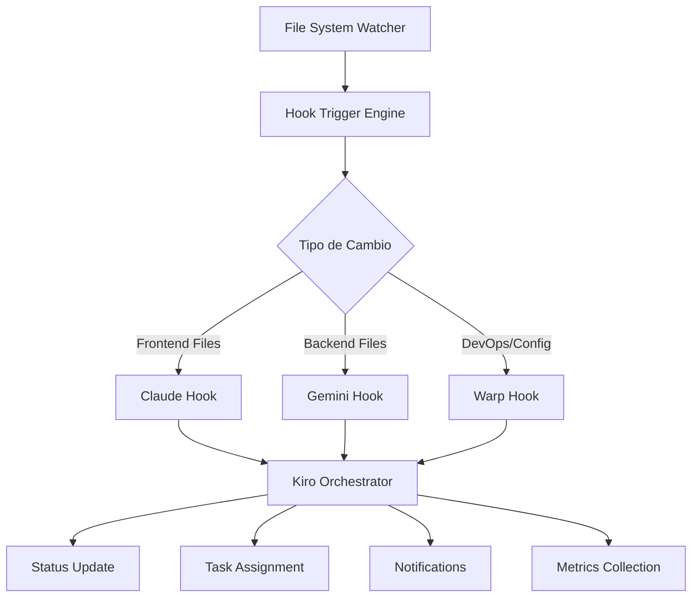

# Sistema de Agent Hooks para Orquestación

## Arquitectura del Sistema de Hooks



## Configuración Principal del Sistema

### Hook Engine Configuration

```json
{
  "hookSystem": {
    "enabled": true,
    "watchPaths": [
      "src/frontend/**/*",
      "api/**/*",
      "tests/**/*",
      "docker-compose.yml",
      "package.json",
      "composer.json"
    ],
    "excludePaths": [
      "node_modules/**/*",
      "vendor/**/*",
      ".git/**/*",
      "*.log",
      "*.cache"
    ],
    "agents": {
      "claude": {
        "patterns": ["src/frontend/**/*"],
        "hooks": ["claude-changes-detector"]
      },
      "gemini": {
        "patterns": ["api/**/*", "tests/unit/backend/**/*"],
        "hooks": ["gemini-changes-detector"]
      },
      "warp": {
        "patterns": ["docker-compose.yml", "*.json", "scripts/**/*"],
        "hooks": ["warp-integration-hook"]
      }
    }
  }
}
```

### Hook Execution Engine

```javascript
// .kiro/hooks/hook-engine.js
class HookEngine {
  constructor() {
    this.watchers = new Map();
    this.hooks = new Map();
    this.agents = ["claude", "gemini", "warp"];
  }

  async initialize() {
    console.log("🔧 Inicializando sistema de hooks...");

    // Cargar configuración de hooks
    await this.loadHookConfigurations();

    // Inicializar watchers de archivos
    await this.initializeFileWatchers();

    // Registrar hooks de agentes
    await this.registerAgentHooks();

    console.log("✅ Sistema de hooks inicializado");
  }

  async loadHookConfigurations() {
    const hookFiles = [
      "claude-changes-detector.md",
      "gemini-changes-detector.md",
      "warp-integration-hook.md",
    ];

    for (const hookFile of hookFiles) {
      const config = await this.parseHookConfig(hookFile);
      this.hooks.set(config.name, config);
    }
  }

  async initializeFileWatchers() {
    const chokidar = require("chokidar");

    // Watcher para archivos de Claude (Frontend)
    const claudeWatcher = chokidar.watch("src/frontend/**/*", {
      ignored: /node_modules/,
      persistent: true,
    });

    claudeWatcher.on("change", (path) => this.handleFileChange("claude", path));
    claudeWatcher.on("add", (path) => this.handleFileAdd("claude", path));

    // Watcher para archivos de Gemini (Backend)
    const geminiWatcher = chokidar.watch(
      ["api/**/*", "tests/unit/backend/**/*"],
      {
        ignored: /vendor/,
        persistent: true,
      }
    );

    geminiWatcher.on("change", (path) => this.handleFileChange("gemini", path));
    geminiWatcher.on("add", (path) => this.handleFileAdd("gemini", path));

    // Watcher para archivos de Warp (DevOps)
    const warpWatcher = chokidar.watch(
      ["docker-compose.yml", "package.json", "composer.json", "scripts/**/*"],
      {
        persistent: true,
      }
    );

    warpWatcher.on("change", (path) => this.handleFileChange("warp", path));

    this.watchers.set("claude", claudeWatcher);
    this.watchers.set("gemini", geminiWatcher);
    this.watchers.set("warp", warpWatcher);
  }

  async handleFileChange(agent, filePath) {
    console.log(`📁 Cambio detectado por ${agent}: ${filePath}`);

    // Analizar el tipo de cambio
    const changeType = this.analyzeChangeType(agent, filePath);

    // Ejecutar hooks correspondientes
    await this.executeHooks(agent, changeType, filePath);
  }

  async handleFileAdd(agent, filePath) {
    console.log(`📄 Nuevo archivo detectado por ${agent}: ${filePath}`);

    // Detectar posible completitud de tarea
    const taskCompletion = await this.detectTaskCompletion(agent, filePath);

    if (taskCompletion) {
      await this.notifyTaskCompletion(agent, taskCompletion);
    }
  }

  async detectTaskCompletion(agent, filePath) {
    const completionPatterns = {
      claude: {
        LoginForm: [
          "LoginForm.tsx",
          "LoginForm.test.tsx",
          "LoginForm.module.css",
        ],
        LogoutButton: ["LogoutButton.tsx", "LogoutButton.test.tsx"],
        ForgotPassword: ["ForgotPasswordForm.tsx", "ResetPasswordForm.tsx"],
      },
      gemini: {
        UserRepository: ["UserRepository.php", "UserRepositoryTest.php"],
        AuthService: ["AuthService.php", "AuthServiceTest.php"],
        JwtService: ["JwtService.php", "JwtServiceTest.php"],
      },
      warp: {
        DockerOptimization: ["docker-compose.yml", "Dockerfile"],
        DeploymentPrep: ["deployment/**/*", "scripts/deploy.sh"],
      },
    };

    // Lógica de detección basada en patrones
    for (const [taskName, requiredFiles] of Object.entries(
      completionPatterns[agent] || {}
    )) {
      if (this.checkTaskCompletion(taskName, requiredFiles, filePath)) {
        return {
          task: taskName,
          agent: agent,
          completedFile: filePath,
          timestamp: new Date().toISOString(),
        };
      }
    }

    return null;
  }

  async notifyTaskCompletion(agent, completion) {
    console.log(`🎉 Tarea completada detectada: ${agent} - ${completion.task}`);

    // Actualizar sistema de seguimiento
    await this.updateTaskStatus(agent, completion.task, "completed");

    // Notificar a Kiro
    await this.notifyOrchestrator({
      type: "task_completed",
      agent: agent,
      task: completion.task,
      timestamp: completion.timestamp,
    });

    // Preparar siguiente tarea
    await this.prepareNextTask(agent);
  }

  async updateTaskStatus(agent, task, status) {
    const { exec } = require("child_process");
    const command = `node .kiro/specs/auth-integration/update-status.js complete-task ${agent} "${task}" "Completado automáticamente por sistema de hooks"`;

    exec(command, (error, stdout, stderr) => {
      if (error) {
        console.error(`Error actualizando estado: ${error}`);
      } else {
        console.log(`✅ Estado actualizado: ${agent} - ${task}`);
      }
    });
  }

  async notifyOrchestrator(notification) {
    // Enviar notificación a Kiro
    const message = `🤖 Hook System: ${notification.type} - ${notification.agent} completó ${notification.task}`;

    const { exec } = require("child_process");
    const command = `node .kiro/specs/auth-integration/update-status.js add-comment kiro "${message}"`;

    exec(command, (error, stdout, stderr) => {
      if (!error) {
        console.log("📢 Orquestador notificado");
      }
    });
  }

  async executeHooks(agent, changeType, filePath) {
    const hooks = this.hooks.get(`${agent}-changes-detector`);

    if (hooks && hooks.actions) {
      for (const action of hooks.actions) {
        await this.executeHookAction(agent, action, filePath);
      }
    }
  }

  async executeHookAction(agent, action, filePath) {
    switch (action) {
      case "run_tests":
        await this.runTests(agent, filePath);
        break;
      case "validate_code_style":
        await this.validateCodeStyle(agent, filePath);
        break;
      case "update_status":
        await this.updateAgentStatus(agent, filePath);
        break;
      case "notify_orchestrator":
        await this.notifyOrchestrator({
          type: "file_change",
          agent: agent,
          file: filePath,
        });
        break;
    }
  }

  async runTests(agent, filePath) {
    const { exec } = require("child_process");

    if (agent === "gemini" && filePath.includes(".php")) {
      exec("./scripts/test-docker.sh", (error, stdout, stderr) => {
        if (!error) {
          console.log(`✅ Tests ejecutados para ${agent}`);
        }
      });
    } else if (agent === "claude" && filePath.includes(".tsx")) {
      exec("cd src/frontend && npm test", (error, stdout, stderr) => {
        if (!error) {
          console.log(`✅ Tests ejecutados para ${agent}`);
        }
      });
    }
  }
}

// Inicializar sistema de hooks
const hookEngine = new HookEngine();
hookEngine.initialize();

module.exports = HookEngine;
```

## Scripts de Inicialización

### Hook System Starter

```bash
#!/bin/bash
# .kiro/hooks/start-hook-system.sh

echo "🚀 Iniciando sistema de hooks para orquestación..."

# Verificar dependencias
if ! command -v node &> /dev/null; then
    echo "❌ Node.js no encontrado"
    exit 1
fi

# Instalar dependencias si es necesario
if [ ! -d "node_modules" ]; then
    npm install chokidar
fi

# Inicializar sistema de hooks
node .kiro/hooks/hook-engine.js &
HOOK_PID=$!

echo "✅ Sistema de hooks iniciado (PID: $HOOK_PID)"
echo $HOOK_PID > .kiro/hooks/hook-system.pid

# Inicializar monitoreo de Warp
.kiro/hooks/warp-docker-monitor.sh &
WARP_PID=$!

echo "✅ Monitoreo Warp iniciado (PID: $WARP_PID)"
echo $WARP_PID > .kiro/hooks/warp-monitor.pid

echo "🎯 Sistema de orquestación con hooks activo"
echo "📊 Monitoreando cambios de Claude, Gemini y Warp"
```

### Hook System Status

```bash
#!/bin/bash
# .kiro/hooks/hook-system-status.sh

echo "📊 ESTADO DEL SISTEMA DE HOOKS"
echo "════════════════════════════════"

# Verificar si el sistema está ejecutándose
if [ -f ".kiro/hooks/hook-system.pid" ]; then
    HOOK_PID=$(cat .kiro/hooks/hook-system.pid)
    if ps -p $HOOK_PID > /dev/null; then
        echo "✅ Hook Engine: Activo (PID: $HOOK_PID)"
    else
        echo "❌ Hook Engine: Inactivo"
    fi
else
    echo "❌ Hook Engine: No iniciado"
fi

# Verificar Warp monitor
if [ -f ".kiro/hooks/warp-monitor.pid" ]; then
    WARP_PID=$(cat .kiro/hooks/warp-monitor.pid)
    if ps -p $WARP_PID > /dev/null; then
        echo "✅ Warp Monitor: Activo (PID: $WARP_PID)"
    else
        echo "❌ Warp Monitor: Inactivo"
    fi
else
    echo "❌ Warp Monitor: No iniciado"
fi

# Mostrar estadísticas
echo ""
echo "📈 ESTADÍSTICAS DE HOOKS"
echo "════════════════════════"
echo "Hooks registrados: 3 (Claude, Gemini, Warp)"
echo "Archivos monitoreados: $(find src/frontend api tests -name "*.tsx" -o -name "*.php" | wc -l)"
echo "Última actividad: $(date)"
```

## Integración con Sistema Existente

### Actualizar update-status.js para Warp

```javascript
// Añadir Warp como agente válido
const validTeams = ["kiro", "claude", "gemini", "warp"];

// Añadir tareas específicas de Warp
const warpTasks = {
  "W.1": "Configurar monitoreo continuo de contenedores",
  "W.2": "Automatizar testing suite completa",
  "W.3": "Optimizar performance de desarrollo",
  "W.4": "Preparar pipeline de deployment",
  "W.5": "Configurar backup automático de base de datos",
};
```

### Actualizar status.json

```json
{
  "team_status": {
    "warp": {
      "current_task": "W.1 Configurar monitoreo continuo",
      "status": "active",
      "last_update": "2025-07-22T18:00:00-06:00",
      "next_task": "W.2 Automatizar testing suite",
      "notes": "Agente DevOps - monitoreo y automatización activos"
    }
  },
  "integration_points": {
    "hook_system": {
      "status": "active",
      "agents_monitored": ["claude", "gemini", "warp"],
      "last_detection": "2025-07-22T18:00:00-06:00"
    }
  }
}
```

## Comandos de Gestión

```bash
# Iniciar sistema de hooks
.kiro/hooks/start-hook-system.sh

# Ver estado del sistema
.kiro/hooks/hook-system-status.sh

# Detener sistema de hooks
.kiro/hooks/stop-hook-system.sh

# Reiniciar sistema de hooks
.kiro/hooks/restart-hook-system.sh

# Ver logs de hooks
tail -f .kiro/hooks/hook-system.log
```

Este sistema de hooks convierte la orquestación en un proceso **completamente automatizado** donde:

1. **Claude** trabaja en frontend y sus cambios se detectan automáticamente
2. **Gemini** trabaja en backend y sus completitudes se registran automáticamente
3. **Warp** maneja DevOps y reporta automáticamente el estado de infraestructura
4. **Kiro** recibe notificaciones automáticas y puede enfocar su tiempo en coordinación estratégica

¡La orquestación se vuelve mucho más eficiente y reactiva!
