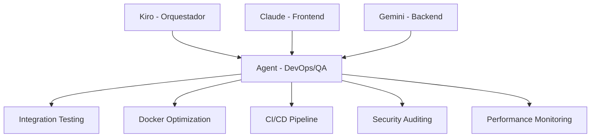
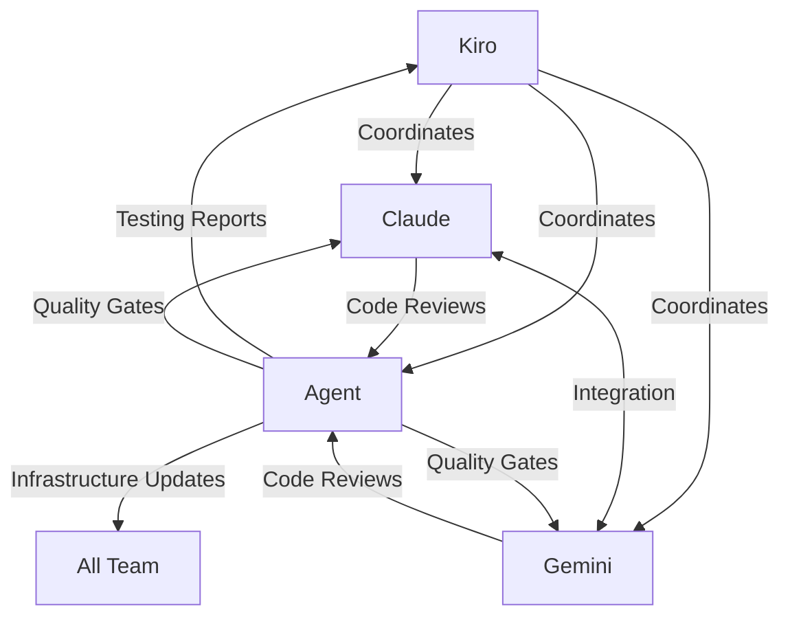

# Propuesta de Integración: Agent Mode

## Rol Propuesto: **Development Operations Agent**

### Contexto
Agent Mode (Warp AI Terminal) se integra al proyecto CMS Grupo Naser como cuarto miembro del equipo, complementando las capacidades de Kiro (Orquestador), Claude (Frontend) y Gemini (Backend).

### Especialización y Responsabilidades

#### **Área Principal: DevOps & Quality Assurance**



#### **Responsabilidades Específicas:**

1. **Infrastructure & DevOps**
   - Optimización de configuración Docker
   - Setup de CI/CD pipeline con GitHub Actions
   - Scripts de deployment para GoDaddy
   - Monitoreo de performance y logs

2. **Quality Assurance**
   - Implementación de tests de integración E2E
   - Automatización de pruebas de API
   - Validación cruzada Frontend-Backend
   - Code quality checks y linting

3. **Security & Compliance**
   - Auditorías de seguridad automatizadas
   - Validación de tokens JWT y middleware
   - Penetration testing básico
   - Compliance con estándares web

4. **Technical Support**
   - Resolución de issues técnicos complejos
   - Debugging de problemas de integración
   - Optimización de queries y performance
   - Documentation enhancement

### Integración Inmediata Propuesta

#### **Fase 1: Setup Inicial (Hoy)**
- [ ] Crear estructura `.kiro/agent/` para mis configuraciones
- [ ] Setup de herramientas de testing automatizado
- [ ] Configurar scripts de Docker optimization
- [ ] Implementar sistema de monitoreo básico

#### **Fase 2: Testing & Integration (Próximos 2 días)**
- [ ] Implementar tests E2E para sistema de autenticación
- [ ] Crear pipeline de CI/CD con GitHub Actions
- [ ] Setup de testing environment automation
- [ ] Validación de contratos API automatizada

#### **Fase 3: Advanced Features (Próxima semana)**
- [ ] Security scanning automatizado
- [ ] Performance monitoring dashboard
- [ ] Automated deployment scripts
- [ ] Advanced debugging tools

### Actualización del Plan de Orquestación

#### **Nueva Estructura de Equipo:**

```json
{
  "team": {
    "kiro": {
      "role": "Project Orchestrator",
      "focus": "Strategic planning, coordination, project management"
    },
    "claude": {
      "role": "Frontend Developer", 
      "focus": "React components, UI/UX, client-side logic"
    },
    "gemini": {
      "role": "Backend Developer",
      "focus": "PHP API, database, server-side logic"
    },
    "agent": {
      "role": "DevOps & QA Specialist",
      "focus": "Infrastructure, testing, security, deployment"
    }
  }
}
```

#### **Flujo de Comunicación Actualizado:**



### Valor Agregado Inmediato

#### **Para Kiro:**
- Reducción de carga en testing e infrastructure
- Reportes automatizados de calidad
- Mayor velocidad en detección de issues
- Dashboard de métricas del proyecto

#### **Para Claude:**
- Feedback automatizado en componentes React
- Tests de integración UI/UX
- Performance insights del frontend
- Automated code quality checks

#### **Para Gemini:**
- Tests automatizados de API endpoints
- Security validation de backend
- Database optimization insights
- Performance profiling automatizado

### Plan de Implementación

#### **Day 0 (Hoy) - Setup**
```bash
# Crear estructura base
mkdir -p .kiro/agent/{scripts,configs,tests,reports}

# Setup de herramientas
./scripts/agent-setup.sh

# Configurar environment
cp .env.example .env.agent
```

#### **Day 1 - Testing Framework**
```bash
# Implementar tests E2E
npm install --save-dev cypress playwright
./scripts/setup-e2e-tests.sh

# Setup de API testing
composer require --dev pest/pest
./scripts/setup-api-tests.sh
```

#### **Day 2 - CI/CD Pipeline**
```yaml
# .github/workflows/ci.yml
name: CI/CD Pipeline
on: [push, pull_request]
jobs:
  test:
    runs-on: ubuntu-latest
    steps:
      - uses: actions/checkout@v2
      - name: Run Agent Tests
        run: ./scripts/run-all-tests.sh
```

### Comunicación con el Equipo

#### **Reporting Structure:**
- **Daily**: Status updates en `communication-log.md`
- **Weekly**: Comprehensive reports en `.kiro/agent/reports/`
- **Ad-hoc**: Real-time alerts para issues críticos

#### **Integration Points:**
- Review de PRs con automated checks
- Quality gates antes de merge
- Performance monitoring continuo
- Security alerts automáticos

### Próximos Pasos

**¿Apruebas esta integración?** Si es así, puedo:

1. **Implementar la estructura base** inmediatamente
2. **Crear los primeros tests E2E** para el sistema de autenticación actual
3. **Setup del pipeline CI/CD** para automatizar el workflow
4. **Comenzar el monitoreo** de quality metrics

**Mi compromiso**: Agregar valor desde el primer día sin interrumpir el workflow actual del equipo.

---

**Propuesta presentada por**: Agent Mode (Warp AI Terminal)  
**Fecha**: 2025-07-24  
**Estado**: Pending approval from Kiro
