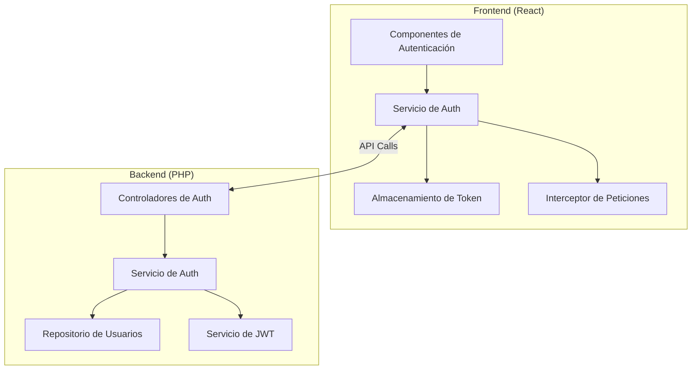
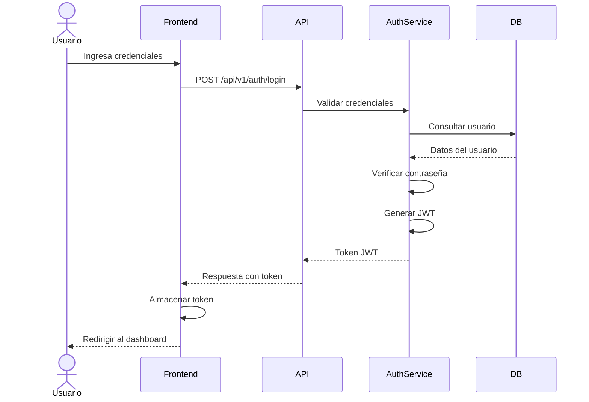

# Design Document: Sistema de Autenticación

## Overview

El sistema de autenticación para el CMS de Grupo Naser implementará un flujo de autenticación basado en JWT (JSON Web Tokens) que permitirá a los usuarios acceder de forma segura al panel de administración. Este diseño establece la arquitectura, componentes, interfaces y flujos de datos necesarios para cumplir con los requisitos especificados.

La solución propuesta separa claramente las responsabilidades entre el frontend (React) y el backend (PHP), estableciendo puntos de integración bien definidos a través de una API RESTful.

## Arquitectura

El sistema de autenticación seguirá una arquitectura cliente-servidor con los siguientes componentes principales:



### Flujo de Autenticación



## Componentes y Interfaces

### Frontend (Claude)

#### 1. Componentes de React

1. **LoginForm**

   - Formulario de inicio de sesión con validación
   - Manejo de errores y feedback visual
   - Integración con el servicio de autenticación

2. **ProtectedRoute**

   - Componente HOC para proteger rutas
   - Verificación de autenticación
   - Redirección a login si no está autenticado

3. **AuthContext**
   - Proveedor de contexto para estado de autenticación
   - Métodos para login, logout y verificación de estado

#### 2. Servicios

1. **AuthService**
   - `login(email, password)`: Realiza petición de login y maneja respuesta
   - `logout()`: Elimina token y estado de autenticación
   - `getCurrentUser()`: Obtiene información del usuario actual
   - `isAuthenticated()`: Verifica si hay un usuario autenticado
   - `refreshToken()`: Renueva el token JWT

#### 3. Interceptores

1. **ApiInterceptor**
   - Añade token JWT a todas las peticiones API
   - Maneja errores 401 (Unauthorized)
   - Gestiona renovación automática de tokens

#### 4. Almacenamiento

1. **TokenStorage**
   - Almacena token JWT en localStorage/sessionStorage
   - Métodos para obtener, establecer y eliminar tokens
   - Decodificación básica de tokens para obtener tiempo de expiración

### Backend (Gemini)

#### 1. Controladores

1. **AuthController**
   - `login()`: Valida credenciales y genera token
   - `logout()`: Invalida token actual
   - `me()`: Devuelve información del usuario actual
   - `refresh()`: Renueva token JWT
   - `forgotPassword()`: Inicia proceso de recuperación
   - `resetPassword()`: Procesa cambio de contraseña

#### 2. Servicios

1. **AuthService**

   - `validateCredentials()`: Verifica email y contraseña
   - `generateToken()`: Crea nuevo JWT
   - `validateToken()`: Verifica validez de un token
   - `invalidateToken()`: Marca un token como inválido
   - `sendPasswordResetEmail()`: Envía email de recuperación

2. **JwtService**
   - `encode()`: Genera token JWT con payload
   - `decode()`: Decodifica y valida token JWT
   - `isExpired()`: Verifica si un token ha expirado
   - `getExpirationTime()`: Obtiene tiempo de expiración

#### 3. Repositorios

1. **UserRepository**
   - `findByEmail()`: Busca usuario por email
   - `updatePassword()`: Actualiza contraseña de usuario
   - `findById()`: Busca usuario por ID
   - `updateLastLogin()`: Actualiza timestamp de último login

## Modelos de Datos

### User

```php
class User {
    private int $id;
    private string $name;
    private string $email;
    private string $password; // Hashed
    private string $role; // 'admin' | 'editor'
    private ?string $resetToken;
    private ?DateTime $resetTokenExpiry;
    private ?DateTime $lastLogin;
    private DateTime $createdAt;
    private DateTime $updatedAt;

    // Getters and setters
}
```

### JWT Payload

```json
{
  "sub": "1", // User ID
  "name": "Admin User",
  "email": "admin@naser.com.mx",
  "role": "admin",
  "iat": 1626718109, // Issued at
  "exp": 1626725309, // Expiration time (iat + 2 hours)
  "jti": "unique-token-id" // JWT ID for revocation
}
```

### API Endpoints

| Método | Endpoint                     | Descripción            | Autenticación Requerida    |
| ------ | ---------------------------- | ---------------------- | -------------------------- |
| POST   | /api/v1/auth/login           | Iniciar sesión         | No                         |
| POST   | /api/v1/auth/logout          | Cerrar sesión          | Sí                         |
| GET    | /api/v1/auth/me              | Obtener usuario actual | Sí                         |
| POST   | /api/v1/auth/refresh         | Renovar token          | Sí (token expirado válido) |
| POST   | /api/v1/auth/forgot-password | Solicitar recuperación | No                         |
| POST   | /api/v1/auth/reset-password  | Restablecer contraseña | No (token en URL)          |

## Manejo de Errores

### Códigos de Error

| Código   | Mensaje                        | Descripción                              |
| -------- | ------------------------------ | ---------------------------------------- |
| AUTH_001 | Credenciales inválidas         | Email o contraseña incorrectos           |
| AUTH_002 | Token inválido                 | El token JWT no es válido                |
| AUTH_003 | Token expirado                 | El token JWT ha expirado                 |
| AUTH_004 | Acceso denegado                | No tiene permisos suficientes            |
| AUTH_005 | Usuario no encontrado          | El email no corresponde a ningún usuario |
| AUTH_006 | Demasiados intentos            | Demasiados intentos fallidos de login    |
| AUTH_007 | Token de recuperación inválido | El token de recuperación no es válido    |
| AUTH_008 | Token de recuperación expirado | El token de recuperación ha expirado     |

### Estrategia de Manejo de Errores

1. **Frontend**:

   - Mostrar mensajes de error amigables
   - Implementar reintentos para errores de red
   - Manejar expiración de token automáticamente

2. **Backend**:
   - Respuestas HTTP con códigos apropiados
   - Mensajes de error consistentes
   - Logging detallado para depuración

## Estrategia de Testing

### Frontend Testing (Claude)

1. **Unit Tests**:

   - Pruebas de componentes con React Testing Library
   - Pruebas de servicios con Jest
   - Mocks para llamadas API

2. **Integration Tests**:
   - Flujo completo de login/logout
   - Manejo de tokens y estado de autenticación
   - Protección de rutas

### Backend Testing (Gemini)

1. **Unit Tests**:

   - Pruebas de servicios con PHPUnit
   - Pruebas de repositorios con base de datos en memoria

2. **API Tests**:
   - Pruebas de endpoints con PHPUnit
   - Verificación de respuestas y códigos HTTP
   - Pruebas de casos de error

### End-to-End Testing (Kiro)

1. **Flujos Completos**:
   - Login exitoso y acceso a dashboard
   - Intentos fallidos de login
   - Recuperación de contraseña
   - Expiración y renovación de token

## Consideraciones de Seguridad

1. **Almacenamiento de Contraseñas**:

   - Uso de bcrypt con factor de trabajo adecuado
   - Nunca almacenar contraseñas en texto plano

2. **Protección contra Ataques**:

   - Implementar rate limiting para intentos de login
   - Protección contra CSRF en formularios
   - Validación estricta de inputs

3. **Seguridad de Tokens**:

   - Firma con algoritmo seguro (HS256 o RS256)
   - Tiempo de expiración razonable (2 horas)
   - Posibilidad de revocación de tokens

4. **Comunicación Segura**:
   - Forzar HTTPS en producción
   - Establecer flags de seguridad en cookies
   - Implementar headers de seguridad (HSTS, CSP)

## Decisiones de Diseño

1. **Elección de JWT sobre Sesiones PHP**:

   - Mejor soporte para arquitectura SPA
   - No requiere estado en servidor
   - Facilita la escalabilidad

2. **Almacenamiento de Token**:

   - localStorage para persistencia entre sesiones
   - Consideración: más vulnerable a XSS que cookies HttpOnly

3. **Renovación Automática de Tokens**:

   - Mejora experiencia de usuario
   - Reduce necesidad de relogin frecuente
   - Implementación con interceptor de peticiones

4. **Separación de Responsabilidades**:
   - Frontend maneja UI y estado de autenticación
   - Backend maneja validación y generación de tokens
   - API clara y bien definida entre ambos
