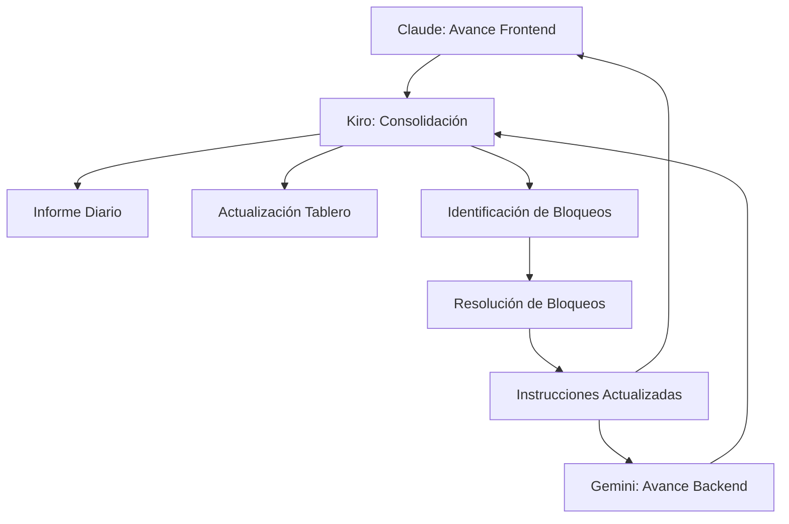

# Plan de Orquestación: Sistema de Autenticación

## Instrucciones por Rol

### Para Claude (Frontend)

```
# Instrucciones para Claude - Desarrollo Frontend de Autenticación

## Contexto
Estás desarrollando los componentes frontend del sistema de autenticación para el CMS de Grupo Naser. Trabajarás en paralelo con Gemini (backend) y serás coordinado por Kiro (orquestador).

## Objetivos
1. Implementar la interfaz de usuario para autenticación
2. Desarrollar servicios frontend para comunicación con API
3. Crear sistema de manejo de tokens y estado de autenticación
4. Asegurar que la experiencia de usuario sea fluida y segura

## Recursos Disponibles
- Documento de requisitos: .kiro/specs/auth-integration/requirements.md
- Documento de diseño: .kiro/specs/auth-integration/design.md
- Lista de tareas: .kiro/specs/auth-integration/tasks.md
- Contrato de API: Será proporcionado por Kiro

## Flujo de Trabajo
1. Revisa los documentos de requisitos y diseño
2. Implementa las tareas asignadas en el orden establecido
3. Comunica diariamente tu progreso a Kiro
4. Coordina con Gemini a través de Kiro para puntos de integración
5. Desarrolla tests unitarios para todos los componentes
6. Participa en las pruebas de integración coordinadas por Kiro

## Entregables Esperados
1. Componentes React para login, logout y recuperación de contraseña
2. Servicios de autenticación y manejo de tokens
3. Sistema de protección de rutas
4. Tests unitarios para todos los componentes y servicios
5. Documentación de uso de los componentes

## Puntos de Integración Clave
1. Formato de peticiones/respuestas API (coordinar con Kiro)
2. Manejo de tokens JWT (coordinar con Gemini a través de Kiro)
3. Flujos de autenticación y recuperación de contraseña

## Reporte de Avance
Reporta diariamente a Kiro:
1. Tareas completadas
2. Tareas en progreso
3. Bloqueos o dudas
4. Necesidades de coordinación con Gemini
```

### Para Gemini (Backend)

```
# Instrucciones para Gemini - Desarrollo Backend de Autenticación

## Contexto
Estás desarrollando los servicios backend del sistema de autenticación para el CMS de Grupo Naser. Trabajarás en paralelo con Claude (frontend) y serás coordinado por Kiro (orquestador).

## Objetivos
1. Implementar API RESTful para autenticación
2. Desarrollar servicios de generación y validación de JWT
3. Crear sistema seguro de almacenamiento y verificación de credenciales
4. Implementar endpoints para todas las funcionalidades requeridas

## Recursos Disponibles
- Documento de requisitos: .kiro/specs/auth-integration/requirements.md
- Documento de diseño: .kiro/specs/auth-integration/design.md
- Lista de tareas: .kiro/specs/auth-integration/tasks.md
- Contrato de API: Será proporcionado por Kiro

## Flujo de Trabajo
1. Revisa los documentos de requisitos y diseño
2. Implementa las tareas asignadas en el orden establecido
3. Comunica diariamente tu progreso a Kiro
4. Coordina con Claude a través de Kiro para puntos de integración
5. Desarrolla tests unitarios para todos los servicios y endpoints
6. Participa en las pruebas de integración coordinadas por Kiro

## Entregables Esperados
1. Endpoints API para login, logout, refresh token y recuperación de contraseña
2. Servicios de autenticación y generación de JWT
3. Repositorio de usuarios con métodos seguros
4. Tests unitarios para todos los endpoints y servicios
5. Documentación de API

## Puntos de Integración Clave
1. Formato de peticiones/respuestas API (coordinar con Kiro)
2. Estructura y validación de tokens JWT (coordinar con Claude a través de Kiro)
3. Manejo de errores y códigos de estado HTTP

## Reporte de Avance
Reporta diariamente a Kiro:
1. Tareas completadas
2. Tareas en progreso
3. Bloqueos o dudas
4. Necesidades de coordinación con Claude
```

### Para Kiro (Orquestador - Yo)

```
# Instrucciones para Kiro - Orquestación del Sistema de Autenticación

## Responsabilidades
1. Coordinar el trabajo entre Claude (frontend) y Gemini (backend)
2. Definir y mantener el contrato de API
3. Facilitar la comunicación entre equipos
4. Realizar pruebas de integración
5. Monitorear el progreso y resolver bloqueos
6. Asegurar que la implementación cumpla con los requisitos

## Flujo de Trabajo Diario
1. Recibir y consolidar reportes de avance de Claude y Gemini
2. Identificar y resolver dependencias o bloqueos
3. Actualizar el tablero de seguimiento
4. Facilitar comunicación para puntos de integración
5. Realizar pruebas de integración para componentes completados
6. Proporcionar retroalimentación a ambos equipos

## Entregables
1. Contrato de API actualizado
2. Tablero de seguimiento de tareas
3. Informes diarios de progreso
4. Pruebas de integración
5. Documentación de integración

## Puntos de Control
1. Definición inicial de contrato API (Día 1)
2. Revisión de implementación de modelos y servicios (Día 3)
3. Prueba de integración de login (Día 5)
4. Prueba de integración de renovación de token (Día 7)
5. Prueba de integración de recuperación de contraseña (Día 9)
6. Revisión final de seguridad (Día 10)
```

## Sistema de Seguimiento

### Tablero de Tareas

Utilizaré un tablero Kanban para seguir el progreso de las tareas, con las siguientes columnas:

1. **Pendiente**: Tareas aún no iniciadas
2. **En Progreso**: Tareas actualmente en desarrollo
3. **En Revisión**: Tareas completadas pendientes de revisión
4. **Completado**: Tareas finalizadas y aprobadas

Para cada tarea, registraré:

- Responsable (Claude/Gemini/Kiro)
- Fecha de inicio
- Fecha estimada de finalización
- Fecha real de finalización
- Dependencias
- Estado actual
- Comentarios/Bloqueos

### Informe Diario de Progreso

Cada día, generaré un informe de progreso con el siguiente formato:

```markdown
# Informe Diario: [FECHA]

## Resumen de Avance

- Tareas completadas hoy: X
- Tareas en progreso: Y
- Porcentaje total completado: Z%
- Estado general: [En tiempo/Con retraso/Adelantado]

## Detalle por Equipo

### Claude (Frontend)

- Completado:
  - [Lista de tareas]
- En progreso:
  - [Lista de tareas]
- Bloqueos:
  - [Lista de bloqueos]

### Gemini (Backend)

- Completado:
  - [Lista de tareas]
- En progreso:
  - [Lista de tareas]
- Bloqueos:
  - [Lista de bloqueos]

## Puntos de Integración

- [Estado de los puntos de integración]

## Plan para mañana

- Claude: [Tareas planificadas]
- Gemini: [Tareas planificadas]
- Kiro: [Tareas planificadas]

## Riesgos Identificados

- [Lista de riesgos]

## Notas Adicionales

- [Notas relevantes]
```

### Métricas de Seguimiento

Monitorearé las siguientes métricas para evaluar el progreso:

1. **Velocidad**: Tareas completadas por día
2. **Burndown**: Tareas restantes vs. tiempo
3. **Calidad**: Número de issues encontrados en pruebas
4. **Integración**: Éxito/fallo de pruebas de integración

### Reuniones de Sincronización

Estableceré las siguientes reuniones para mantener la coordinación:

1. **Daily Standup**: Breve reunión diaria para revisar progreso y bloqueos
2. **Revisión de Integración**: Después de cada punto de integración clave
3. **Retrospectiva**: Al finalizar el feature para identificar mejoras

## Gestión de Riesgos

### Riesgos Identificados

1. **Desalineación API**: Frontend y backend implementan interfaces incompatibles

   - **Mitigación**: Contrato de API detallado y pruebas tempranas de integración

2. **Seguridad Insuficiente**: Implementación con vulnerabilidades

   - **Mitigación**: Revisión de seguridad en cada etapa y auditoría final

3. **Retrasos en Componentes Críticos**: Bloqueo de tareas dependientes

   - **Mitigación**: Identificación temprana de dependencias y priorización

4. **Problemas de Integración**: Dificultades al unir frontend y backend
   - **Mitigación**: Puntos de integración incrementales y pruebas continuas

### Proceso de Escalamiento

Para cada riesgo o bloqueo identificado:

1. Documentar el problema en detalle
2. Evaluar impacto en cronograma y dependencias
3. Proponer soluciones alternativas
4. Coordinar entre equipos para implementar solución
5. Actualizar plan y cronograma según sea necesario

## Plan de Comunicación

### Canales de Comunicación

1. **Informes Diarios**: Documentación formal de progreso
2. **Chat en Tiempo Real**: Para consultas rápidas y coordinación
3. **Reuniones Sincrónicas**: Para discusiones complejas y toma de decisiones
4. **Repositorio de Documentación**: Para información persistente y referencia

### Flujo de Información



## Criterios de Éxito

El feature de autenticación se considerará completado exitosamente cuando:

1. Todos los requisitos estén implementados y verificados
2. Las pruebas unitarias pasen al 100%
3. Las pruebas de integración pasen al 100%
4. La auditoría de seguridad no encuentre vulnerabilidades críticas
5. La experiencia de usuario sea fluida y sin errores
6. La documentación esté completa y actualizada

## Entregables Finales

Al completar el feature, se entregarán:

1. Código fuente completo y documentado
2. Pruebas unitarias y de integración
3. Documentación de API
4. Guía de uso para desarrolladores
5. Informe de seguridad
6. Lecciones aprendidas y recomendaciones
