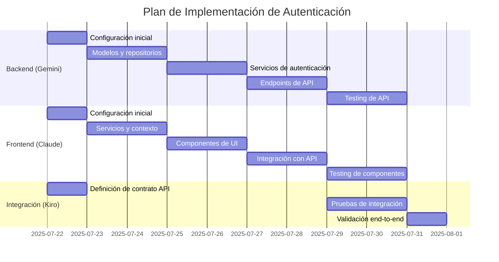

# Implementation Plan

## Flujo de Trabajo Integrado

Este plan de implementación está diseñado para que Claude (Frontend) y Gemini (Backend) trabajen en paralelo con puntos de integración claramente definidos. Kiro (yo) orquestaré el proceso, asegurando que ambos equipos estén alineados y que la integración sea fluida.

## Tareas de Implementación

- [ ] 1. Configuración inicial y estructura del proyecto

  - [x] 1.1 Gemini: Configurar estructura de carpetas para autenticación en backend

    - Crear directorios para controladores, servicios y repositorios
    - Configurar autoloading para nuevas clases
    - _Requirements: 1.1, 2.1, 3.1, 4.1_

  - [ ] 1.2 Claude: Configurar estructura de carpetas para autenticación en frontend

    - Crear directorios para componentes, servicios y contextos
    - Configurar rutas protegidas en React Router
    - _Requirements: 1.1, 1.3, 2.1_

  - [x] 1.3 Kiro: Definir contrato de API para autenticación
    - Documentar formato exacto de requests/responses
    - Establecer convenciones de manejo de errores
    - Crear colección Postman para pruebas de API
    - _Requirements: 1.1, 2.1, 4.3_

- [ ] 2. Implementación de modelos y servicios base

  - [x] 2.1 Gemini: Implementar modelo de Usuario

    - Crear clase User con propiedades requeridas
    - Implementar métodos para hash y verificación de contraseñas
    - Escribir tests unitarios para el modelo
    - _Requirements: 1.1, 3.1, 4.1_

  - [ ] 2.2 Gemini: Implementar UserRepository

    - Crear interfaz de repositorio
    - Implementar métodos para buscar y actualizar usuarios
    - Escribir tests unitarios para el repositorio
    - _Requirements: 1.1, 3.4, 4.1_

  - [ ] 2.3 Claude: Implementar AuthContext y hooks

    - Crear contexto para estado de autenticación
    - Implementar hooks personalizados (useAuth)
    - Escribir tests unitarios para el contexto
    - _Requirements: 1.1, 1.3, 2.1, 2.3_

  - [ ] 2.4 Claude: Implementar TokenStorage
    - Crear servicio para manejo de tokens JWT
    - Implementar métodos para almacenar, recuperar y eliminar tokens
    - Escribir tests unitarios para el servicio
    - _Requirements: 2.1, 2.3, 4.4_

- [ ] 3. Implementación de servicios de autenticación

  - [ ] 3.1 Gemini: Implementar JwtService

    - Crear servicio para generación y validación de tokens JWT
    - Implementar métodos para codificar y decodificar tokens
    - Escribir tests unitarios para el servicio
    - _Requirements: 2.1, 2.2, 4.4_

  - [ ] 3.2 Gemini: Implementar AuthService

    - Crear servicio para lógica de autenticación
    - Implementar métodos para validar credenciales y generar tokens
    - Escribir tests unitarios para el servicio
    - _Requirements: 1.1, 1.2, 2.1, 4.1, 4.2_

  - [ ] 3.3 Claude: Implementar ApiService

    - Crear servicio para comunicación con API
    - Implementar interceptores para manejo de tokens
    - Escribir tests unitarios para el servicio
    - _Requirements: 1.1, 2.1, 2.2_

  - [ ] 3.4 Claude: Implementar AuthService frontend
    - Crear servicio para operaciones de autenticación
    - Integrar con ApiService y TokenStorage
    - Escribir tests unitarios para el servicio
    - _Requirements: 1.1, 1.4, 2.1, 2.2_

- [ ] 4. Implementación de endpoints de API

  - [ ] 4.1 Gemini: Implementar endpoint de login

    - Crear controlador y ruta para login
    - Implementar validación de inputs
    - Integrar con AuthService
    - Escribir tests para el endpoint
    - _Requirements: 1.1, 1.2, 4.1, 4.2, 4.3_

  - [ ] 4.2 Gemini: Implementar endpoint de logout

    - Crear controlador y ruta para logout
    - Implementar invalidación de tokens
    - Escribir tests para el endpoint
    - _Requirements: 1.4, 2.5_

  - [ ] 4.3 Gemini: Implementar endpoint de información de usuario

    - Crear controlador y ruta para obtener usuario actual
    - Implementar middleware de autenticación
    - Escribir tests para el endpoint
    - _Requirements: 2.1, 3.1, 3.2, 3.3_

  - [ ] 4.4 Gemini: Implementar endpoint de renovación de token

    - Crear controlador y ruta para refresh token
    - Implementar lógica de renovación
    - Escribir tests para el endpoint
    - _Requirements: 2.2, 2.3_

  - [ ] 4.5 Gemini: Implementar endpoints de recuperación de contraseña
    - Crear controladores y rutas para forgot-password y reset-password
    - Implementar envío de correos y validación de tokens
    - Escribir tests para los endpoints
    - _Requirements: 5.1, 5.2, 5.3, 5.4, 5.5_

- [ ] 5. Implementación de componentes de UI

  - [ ] 5.1 Claude: Implementar componente LoginForm

    - Crear formulario de login con validación
    - Integrar con AuthService
    - Implementar manejo de errores y feedback
    - Escribir tests para el componente
    - _Requirements: 1.1, 1.2, 4.2_

  - [ ] 5.2 Claude: Implementar componente ProtectedRoute

    - Crear componente HOC para proteger rutas
    - Integrar con AuthContext
    - Implementar redirección a login
    - Escribir tests para el componente
    - _Requirements: 1.3, 2.3_

  - [ ] 5.3 Claude: Implementar componentes de recuperación de contraseña

    - Crear formularios para solicitud y restablecimiento
    - Integrar con AuthService
    - Implementar validación y feedback
    - Escribir tests para los componentes
    - _Requirements: 5.1, 5.2, 5.3, 5.4_

  - [ ] 5.4 Claude: Implementar componente de cierre de sesión
    - Crear botón/menú para logout
    - Integrar con AuthService
    - Implementar confirmación y feedback
    - Escribir tests para el componente
    - _Requirements: 1.4_

- [ ] 6. Integración y pruebas end-to-end

  - [ ] 6.1 Kiro: Implementar pruebas de integración para login

    - Crear tests que verifiquen flujo completo frontend-backend
    - Verificar manejo correcto de tokens
    - Validar redirecciones y estado de UI
    - _Requirements: 1.1, 1.2, 1.3_

  - [ ] 6.2 Kiro: Implementar pruebas de integración para logout

    - Crear tests que verifiquen flujo completo de cierre de sesión
    - Verificar limpieza de tokens y estado
    - Validar redirecciones y estado de UI
    - _Requirements: 1.4_

  - [ ] 6.3 Kiro: Implementar pruebas de integración para renovación de token

    - Crear tests que verifiquen renovación automática
    - Simular expiración de tokens
    - Validar continuidad de sesión
    - _Requirements: 2.2, 2.3_

  - [ ] 6.4 Kiro: Implementar pruebas de integración para recuperación de contraseña
    - Crear tests que verifiquen flujo completo de recuperación
    - Validar envío de correos y tokens
    - Verificar restablecimiento exitoso
    - _Requirements: 5.1, 5.2, 5.3, 5.4, 5.5_

- [ ] 7. Optimización y finalización

  - [ ] 7.1 Gemini: Implementar rate limiting para intentos de login

    - Crear middleware para limitar intentos
    - Implementar bloqueo temporal
    - Escribir tests para la funcionalidad
    - _Requirements: 4.2_

  - [ ] 7.2 Claude: Implementar manejo de sesión inactiva

    - Crear detector de inactividad
    - Implementar cierre automático de sesión
    - Escribir tests para la funcionalidad
    - _Requirements: 1.5_

  - [ ] 7.3 Kiro: Realizar auditoría de seguridad
    - Verificar implementación de mejores prácticas
    - Identificar posibles vulnerabilidades
    - Documentar recomendaciones
    - _Requirements: 4.1, 4.2, 4.3, 4.4, 4.5_
