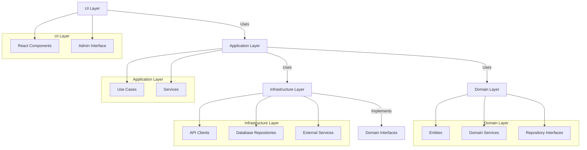
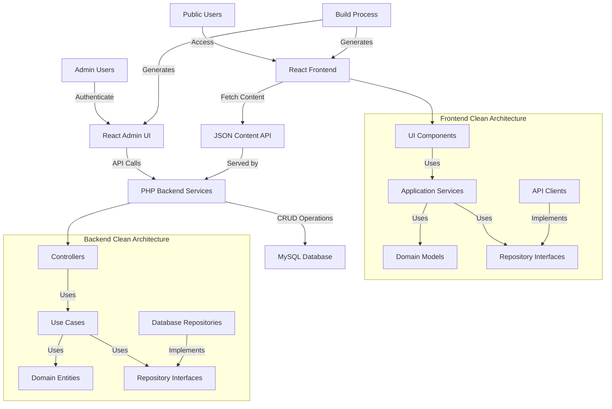
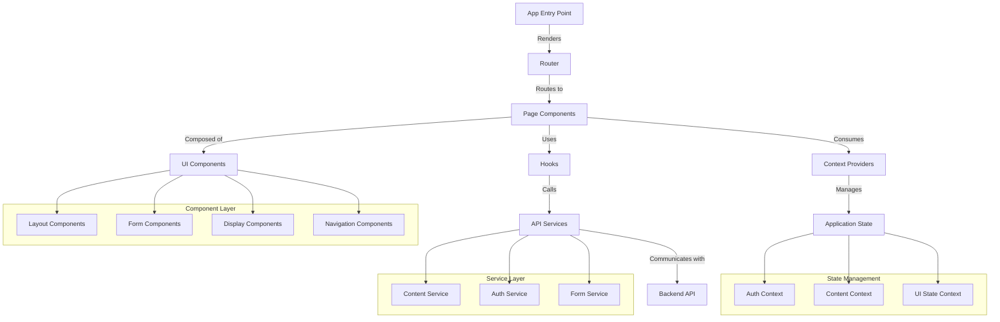
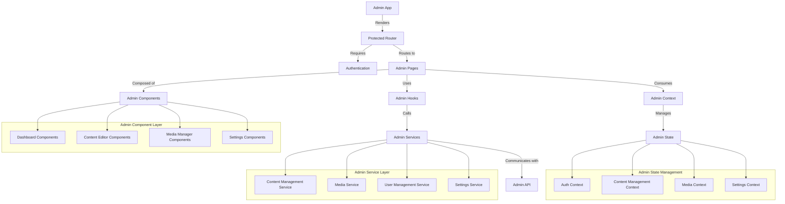
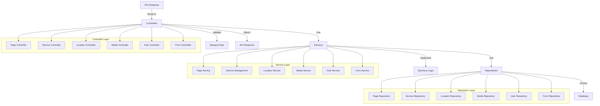
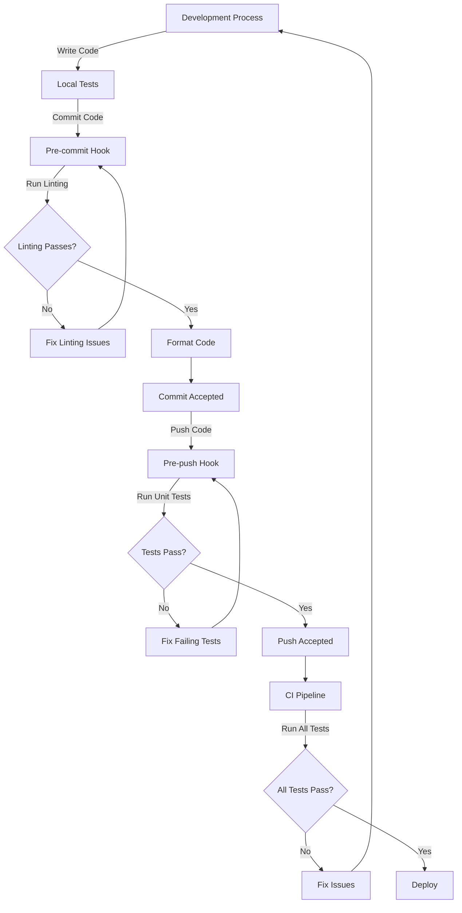
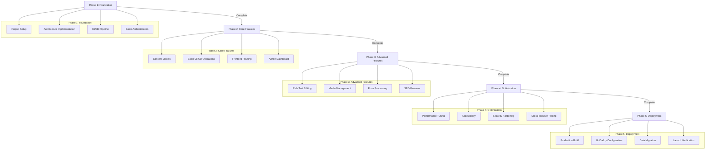
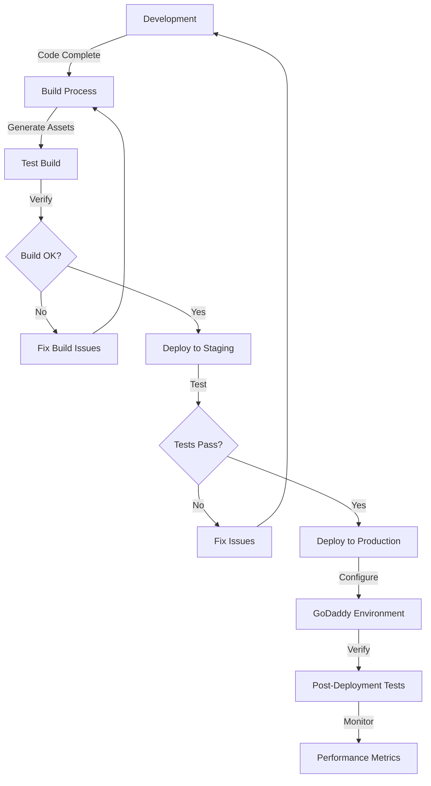
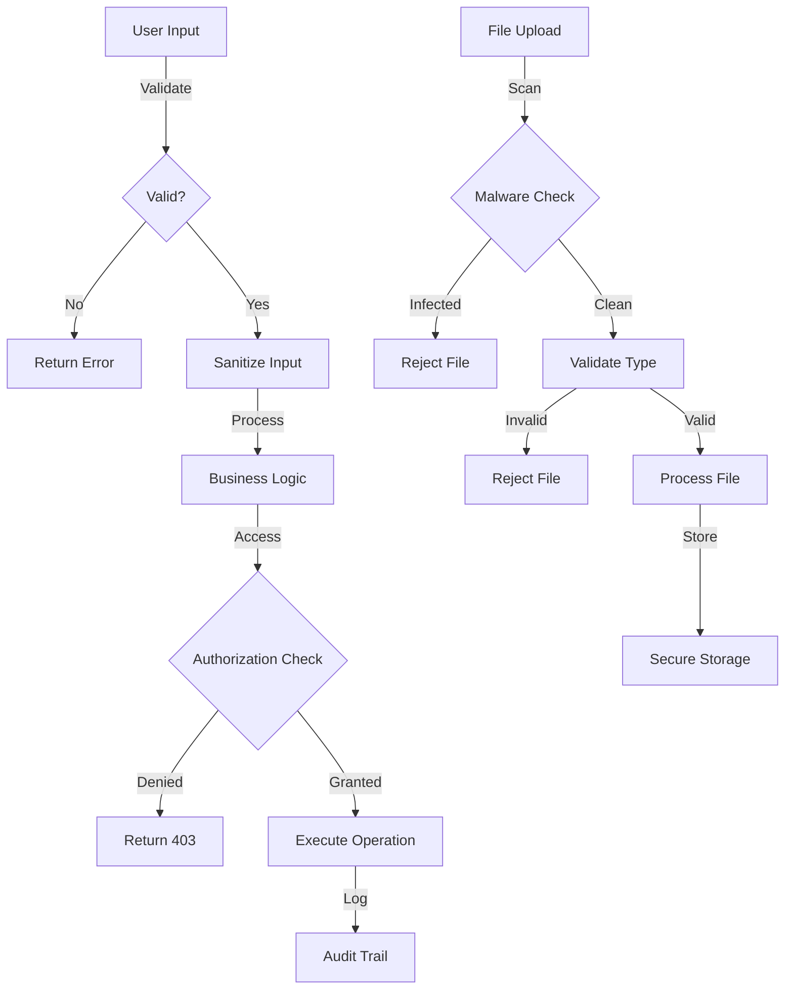
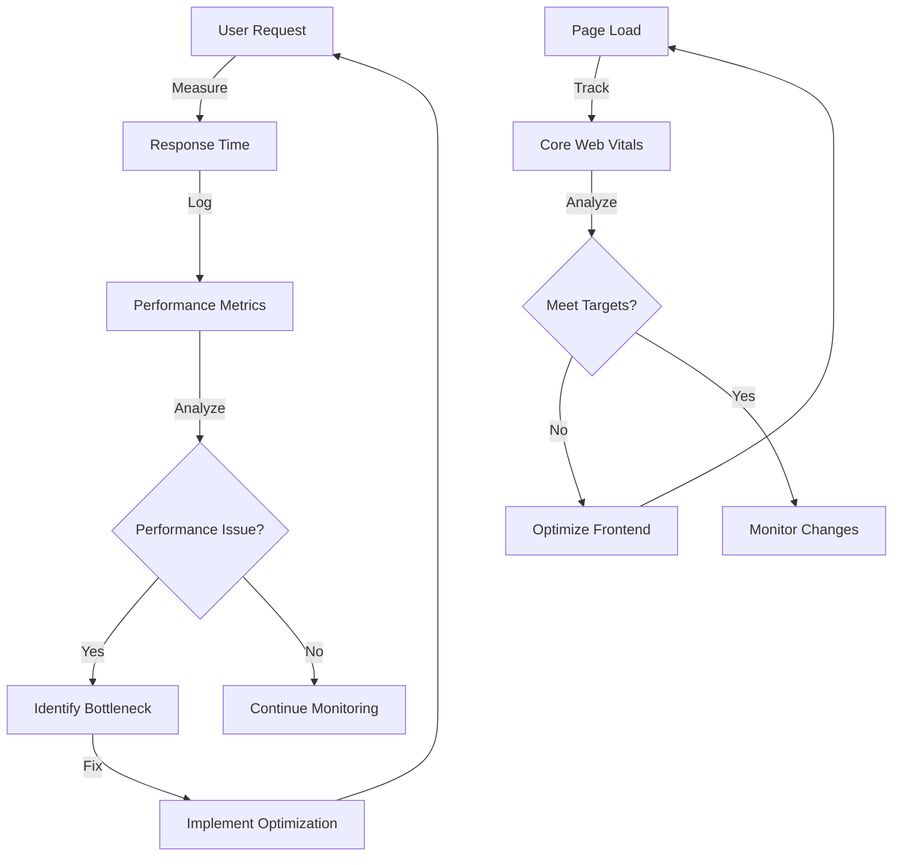

# Design Document

## Overview

This design document outlines the architecture and implementation details for the React CMS for Grupo Naser's website that will be deployed on GoDaddy hosting. The system consists of two main components: a React frontend for public users and a React+PHP admin panel for content management. This design ensures compatibility with GoDaddy's hosting environment while providing a modern, maintainable solution.

### Project Structure

The project will follow this directory structure to maintain clear separation of concerns:

```
/
├── /src
│   ├── /frontend             # Public-facing React website
│   │   ├── /components       # Reusable UI components
│   │   ├── /pages            # Page components
│   │   ├── /hooks            # Custom React hooks
│   │   ├── /context          # React context providers
│   │   ├── /services         # API service clients
│   │   ├── /utils            # Utility functions
│   │   ├── /assets           # Static assets (images, fonts)
│   │   └── /styles           # Global styles and theme
│   │
│   └── /admin                # Admin React application
│       ├── /components       # Admin UI components
│       ├── /pages            # Admin page components
│       ├── /hooks            # Admin-specific hooks
│       ├── /context          # Admin context providers
│       ├── /services         # Admin API service clients
│       └── /utils            # Admin utility functions
│
├── /api                      # PHP backend
│   ├── /controllers          # API endpoint controllers
│   ├── /models               # Data models
│   ├── /services             # Business logic services
│   ├── /repositories         # Data access repositories
│   ├── /middleware           # Request/response middleware
│   └── /utils                # Helper utilities
│
├── /database                 # Database related files
│   ├── /migrations           # Database migration scripts
│   └── /seeds                # Seed data for development
│
├── /public                   # Public assets directory
│   ├── /uploads              # User uploaded content
│   └── /static               # Static assets
│
└── /tests                    # Test files
    ├── /unit                 # Unit tests
    ├── /integration          # Integration tests
    └── /e2e                  # End-to-end tests
```

## Architecture

The system follows a Clean Architecture with Hexagonal pattern that combines React for frontend rendering with PHP for backend services:

1. **Frontend Layer**: React-based Single Page Application (SPA) that renders the public-facing website

   - Pre-rendered React components for SEO optimization
   - Client-side routing with React Router for smooth navigation
   - Responsive design using mobile-first approach
   - Component-based architecture with reusable UI elements
   - State management with React Context API or Redux

2. **Admin Layer**: React-based admin interface with PHP backend

   - Secure authentication system with JWT tokens
   - Content management interfaces with rich text editing
   - Media management system with image optimization
   - Dashboard with content analytics
   - Role-based access control

3. **Data Layer**:

   - MySQL database for content storage
   - JSON-based RESTful API for frontend consumption
   - PHP backend services for data manipulation
   - Repository pattern for data access abstraction
   - Data validation and sanitization middleware

4. **Deployment Layer**:
   - Static asset optimization for GoDaddy hosting
   - PHP compatibility configuration for GoDaddy environment
   - Build process for React applications with code splitting
   - Environment-specific configuration management
   - Automated deployment scripts

### Clean Architecture Overview

The system implements Clean Architecture principles to ensure separation of concerns and maintainability:



### System Architecture



### Frontend Architecture

The frontend architecture follows a component-based approach with clear separation of concerns:



### Admin Panel Architecture

The admin panel architecture is designed for content management with secure authentication:



### Backend API Architecture

The PHP backend follows a layered architecture with clear separation of concerns:



## Components and Interfaces

### Frontend Components

1. **Public Website Components**

   - Header/Navigation Component
   - Home Page Component
   - Services Page Component
   - Locations Page Components
   - Contact Form Component
   - Footer Component

2. **Core UI Components**

   - Button Component
   - Card Component
   - Form Input Components
   - Modal Component
   - Image Gallery Component

3. **Admin Interface Components**
   - Login Component
   - Dashboard Component
   - Page Editor Component
   - Media Manager Component
   - Settings Component

### Backend Services

1. **Authentication Service**

   - Login/Logout API
   - Session Management
   - Permission Handling

2. **Content Management API**

   - Page CRUD Operations
   - Service CRUD Operations
   - Location CRUD Operations
   - Contact Information Management

3. **Media Management API**

   - Image Upload/Optimization
   - Media Library Management
   - File System Operations

4. **Form Handling Service**
   - Form Submission Processing
   - Email Notification System
   - Form Data Storage

### Interfaces

1. **Content API Interface**

```typescript
interface ContentAPI {
  getPage(slug: string): Promise<PageData>;
  getServices(): Promise<Service[]>;
  getLocations(): Promise<Location[]>;
  getContactInfo(): Promise<ContactInfo>;
}
```

2. **Admin API Interface**

```typescript
interface AdminAPI {
  login(username: string, password: string): Promise<AuthResponse>;
  logout(): Promise<void>;
  updatePage(pageId: number, data: PageData): Promise<PageData>;
  uploadMedia(file: File): Promise<MediaItem>;
  // Additional admin operations
}
```

3. **Form Submission Interface**

```typescript
interface FormSubmission {
  submitContactForm(formData: ContactFormData): Promise<SubmissionResult>;
}
```

## Data Models

### Page Model

```typescript
interface Page {
  id: number;
  title: string;
  slug: string;
  content: string;
  metaTitle: string;
  metaDescription: string;
  status: "published" | "draft";
  createdAt: string;
  updatedAt: string;
}
```

### Service Model

```typescript
interface Service {
  id: number;
  name: string;
  description: string;
  shortDescription: string;
  imageUrl: string;
  order: number;
  status: "active" | "inactive";
}
```

### Location Model

```typescript
interface Location {
  id: number;
  name: string;
  address: string;
  phone: string;
  email: string;
  mapUrl: string;
  content: string;
  imageUrl: string;
}
```

### Media Model

```typescript
interface MediaItem {
  id: number;
  filename: string;
  originalFilename: string;
  mimeType: string;
  size: number;
  url: string;
  thumbnailUrl: string;
  createdAt: string;
}
```

### User Model

```typescript
interface User {
  id: number;
  username: string;
  email: string;
  role: "admin" | "editor";
  lastLogin: string;
}
```

## Testing Strategy

### Test Suite Configuration

The project implements a comprehensive testing strategy with the following components:

1. **Unit Testing**

   - Jest for JavaScript/React unit tests
   - PHPUnit for PHP backend tests
   - Test coverage reporting with minimum 80% coverage requirement

2. **Integration Testing**

   - React Testing Library for component integration tests
   - API integration tests with supertest
   - Database integration tests

3. **End-to-End Testing**

   - Playwright for cross-browser E2E tests
   - Automated user flow testing
   - Visual regression testing

4. **Git Hooks with Husky**
   - Pre-commit hooks for linting and formatting
   - Pre-push hooks for running unit tests
   - Commit message validation



### Test Directory Structure

```
/tests
├── /unit
│   ├── /frontend
│   │   ├── /components
│   │   ├── /services
│   │   └── /utils
│   └── /backend
│       ├── /controllers
│       ├── /models
│       └── /services
├── /integration
│   ├── /api
│   ├── /components
│   └── /database
└── /e2e
    ├── /admin
    └── /public
```

## Error Handling

1. **Frontend Error Handling**

   - Global error boundary for React components
   - API request error handling with user-friendly messages
   - Form validation error display

2. **Backend Error Handling**

   - Structured error responses with HTTP status codes
   - Detailed logging for debugging
   - Graceful fallbacks for database connection issues

3. **Error Response Format**

```json
{
  "success": false,
  "error": {
    "code": "ERROR_CODE",
    "message": "User-friendly error message",
    "details": "Technical details (admin only)"
  }
}
```

## Implementation Methodology

To ensure a successful implementation of this project, we will follow the Ripper Five Optimized methodology, which is an adaptive development protocol specifically designed for complex software projects. This methodology combines Agile principles with structured batch-based development and clear mode transitions:

1. **Ripper Five Development Modes**

   - **Research Mode**: Information gathering and project understanding
   - **Innovate Mode**: Brainstorming potential approaches and solutions
   - **Plan Mode**: Creating technical specifications in manageable batches
   - **Code Mode**: Writing or modifying actual code based on approved plans
   - **Execute Mode**: Testing, verifying, and validating implemented changes

2. **Batch-Based Implementation Strategy**

   - Implement features in small, manageable batches (3-5 items per batch)
   - Use layer-based batching (foundation → logic → interface → integration)
   - Clear pause points between batches for review and approval
   - Adaptive batch sizing based on task complexity

3. **Global Operating Principles**

   - **Project Awareness**: Always reference project documentation before starting work
   - **Code Structure**: Limit files to 500 lines maximum and organize in clear modules
   - **Testing**: Create unit tests for all new functionality with expected, edge, and failure cases
   - **Task Management**: Track task completion and document new discoveries
   - **Documentation**: Maintain clear comments and update documentation with changes

4. **Technology-Specific Adaptations**

   - **Frontend**: Components → State → Routing → Integration
   - **Backend**: Models → Controllers → Services → Middleware
   - **Full-Stack**: Backend foundation → Frontend → Integration → Deployment

5. **Quality Assurance Integration**

   - Implement pre-commit and pre-push hooks for code quality checks
   - Maintain comprehensive test coverage across all system components
   - Regular code reviews with clear acceptance criteria
   - Continuous integration to validate all changes

### Implementation Phases

The implementation will follow these phases to ensure steady progress and early validation:



### Quality Assurance Strategy

To maintain high quality throughout the implementation:

1. **Automated Testing**

   - Unit tests for business logic and components
   - Integration tests for API endpoints and data flow
   - End-to-end tests for critical user journeys
   - Visual regression tests for UI components

2. **Code Quality Tools**

   - ESLint and Prettier for JavaScript/TypeScript
   - PHP CodeSniffer for PHP code
   - SonarQube for static code analysis
   - Husky for pre-commit and pre-push hooks

3. **Performance Monitoring**

   - Lighthouse audits for frontend performance
   - New Relic or similar for backend monitoring
   - Core Web Vitals tracking
   - Regular performance review sessions

4. **Security Practices**
   - Regular dependency vulnerability scanning
   - OWASP security checklist implementation
   - Penetration testing before launch
   - Data validation at all system boundaries

## Deployment Strategy

1. **Build Process**

   - React application bundling with optimization
   - Asset minification and compression
   - Environment-specific configuration
   - Tree-shaking and code splitting for optimal bundle size

2. **GoDaddy Deployment**

   - PHP configuration for GoDaddy environment
   - Database setup and migration scripts
   - Static asset deployment strategy
   - Rollback procedures for emergency situations

3. **Maintenance Considerations**
   - Automated backup procedures
   - Documented update mechanisms
   - Comprehensive performance monitoring
   - User feedback collection system

### Deployment Flow



## Security Considerations

1. **Authentication Security**

   - Secure password hashing
   - Session management
   - CSRF protection

2. **Data Security**

   - Input validation and sanitization
   - SQL injection prevention
   - XSS protection

3. **File Upload Security**
   - File type validation
   - Size limitations
   - Malware scanning

### Security Implementation



## Performance Optimization

1. **Frontend Optimization**

   - Code splitting
   - Lazy loading of components
   - Image optimization

2. **Backend Optimization**

   - Database query optimization
   - Caching strategies
   - API response optimization

3. **Asset Delivery**
   - CDN integration where possible
   - Browser caching configuration
   - Compressed asset delivery

### Performance Monitoring


