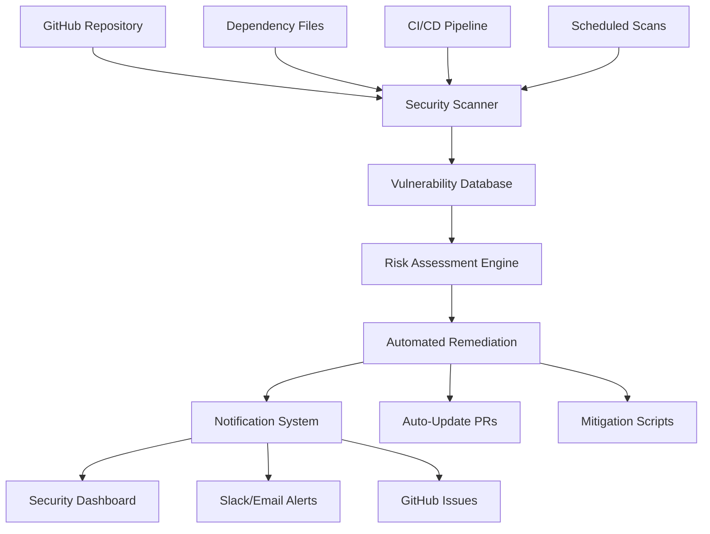

# Design Document

## Overview

The Security Vulnerability Resolution system will enhance the existing Trivy-based security scanning infrastructure to provide comprehensive vulnerability management for the Grupo Naser CMS project. The system will address the immediate CVE-2025-47273 setuptools vulnerability while establishing a robust framework for ongoing security monitoring and automated remediation.

The design leverages the existing CI/CD pipeline with GitHub Actions and extends it with enhanced security scanning, automated dependency updates, and comprehensive reporting capabilities.

## Architecture

### Core Components



### Security Scanning Pipeline

The system will implement a multi-layered security scanning approach:

1. **Pre-commit Scanning**: Local vulnerability checks before code commits
2. **CI/CD Integration**: Enhanced Trivy scanning with additional tools
3. **Scheduled Monitoring**: Daily scans for new vulnerabilities
4. **Dependency Tracking**: Continuous monitoring of all project dependencies

### Data Flow

1. **Trigger Events**: Code commits, scheduled scans, new vulnerability publications
2. **Scanning Process**: Multi-tool vulnerability detection (Trivy, npm audit, composer audit)
3. **Risk Assessment**: Severity classification and impact analysis
4. **Remediation Planning**: Automated fix generation or manual intervention requirements
5. **Implementation**: Automated updates or guided manual fixes
6. **Verification**: Post-fix security validation and testing

## Components and Interfaces

### 1. Enhanced Security Scanner

**Purpose**: Comprehensive vulnerability detection across all project dependencies

**Key Features**:

- Multi-format scanning (package.json, composer.json, requirements.txt)
- Integration with multiple vulnerability databases
- Custom rule definitions for project-specific security requirements
- Performance optimization to minimize CI/CD impact

**Interfaces**:

- GitHub Actions integration
- SARIF output format for GitHub Security tab
- JSON/XML reports for external tools
- Webhook notifications for real-time alerts

### 2. Vulnerability Database Manager

**Purpose**: Centralized vulnerability information management and correlation

**Key Features**:

- CVE database synchronization
- Custom vulnerability definitions
- Historical vulnerability tracking
- Impact assessment algorithms

**Data Sources**:

- National Vulnerability Database (NVD)
- GitHub Advisory Database
- NPM Security Advisories
- Packagist Security Advisories

### 3. Automated Remediation Engine

**Purpose**: Intelligent vulnerability resolution with minimal manual intervention

**Key Features**:

- Dependency update automation
- Compatibility testing integration
- Rollback mechanisms for failed updates
- Custom patch application for complex vulnerabilities

**Update Strategies**:

- **Patch Updates**: Automatic application for security patches
- **Minor Updates**: Automated with comprehensive testing
- **Major Updates**: Manual review with automated preparation
- **Custom Patches**: Manual intervention with guided workflows

### 4. Security Dashboard and Reporting

**Purpose**: Comprehensive security posture visualization and management

**Key Features**:

- Real-time vulnerability status
- Historical trend analysis
- Compliance reporting
- Team performance metrics

**Report Types**:

- Executive summaries
- Technical vulnerability details
- Compliance audit reports
- Performance and resolution metrics

## Data Models

### Vulnerability Record

```typescript
interface VulnerabilityRecord {
  id: string;
  cveId?: string;
  packageName: string;
  packageVersion: string;
  vulnerableVersions: string[];
  fixedVersion?: string;
  severity: "LOW" | "MEDIUM" | "HIGH" | "CRITICAL";
  description: string;
  publishedDate: Date;
  discoveredDate: Date;
  resolvedDate?: Date;
  status: "OPEN" | "IN_PROGRESS" | "RESOLVED" | "ACCEPTED_RISK";
  mitigation?: string;
  references: string[];
}
```

### Security Scan Result

```typescript
interface SecurityScanResult {
  scanId: string;
  timestamp: Date;
  scanType: "SCHEDULED" | "CI_CD" | "MANUAL";
  projectPath: string;
  vulnerabilities: VulnerabilityRecord[];
  summary: {
    total: number;
    critical: number;
    high: number;
    medium: number;
    low: number;
  };
  scanDuration: number;
  status: "COMPLETED" | "FAILED" | "PARTIAL";
}
```

### Remediation Plan

```typescript
interface RemediationPlan {
  planId: string;
  vulnerabilityId: string;
  strategy: "AUTO_UPDATE" | "MANUAL_UPDATE" | "PATCH" | "MITIGATION";
  targetVersion?: string;
  estimatedRisk: "LOW" | "MEDIUM" | "HIGH";
  testingRequired: boolean;
  approvalRequired: boolean;
  steps: RemediationStep[];
  rollbackPlan: string[];
}
```

## Error Handling

### Scanning Failures

- **Network Issues**: Retry mechanisms with exponential backoff
- **Database Unavailability**: Cached vulnerability data with staleness warnings
- **Tool Failures**: Fallback to alternative scanning tools
- **Rate Limiting**: Intelligent request throttling and queuing

### Update Failures

- **Dependency Conflicts**: Detailed conflict analysis and resolution suggestions
- **Test Failures**: Automatic rollback with failure analysis
- **Build Failures**: Incremental update strategies with isolation testing
- **Deployment Issues**: Staged rollout with monitoring and quick rollback

### Notification Failures

- **Multiple Channels**: Email, Slack, GitHub issues as fallback options
- **Escalation Procedures**: Automatic escalation for critical vulnerabilities
- **Retry Logic**: Persistent notification attempts with different channels
- **Manual Override**: Emergency notification procedures for critical issues

## Testing Strategy

### Unit Testing

- **Scanner Components**: Mock vulnerability databases and test detection accuracy
- **Remediation Logic**: Test update strategies with various dependency scenarios
- **Risk Assessment**: Validate severity calculations and impact analysis
- **Notification System**: Test alert generation and delivery mechanisms

### Integration Testing

- **CI/CD Pipeline**: End-to-end testing of security scanning integration
- **External APIs**: Test vulnerability database connections and data synchronization
- **GitHub Integration**: Validate SARIF uploads and security tab integration
- **Automated Updates**: Test pull request generation and merge processes

### Security Testing

- **Scanner Security**: Validate that security tools don't introduce vulnerabilities
- **Access Controls**: Test authentication and authorization for security operations
- **Data Protection**: Ensure vulnerability data is handled securely
- **Audit Trails**: Verify comprehensive logging of all security operations

### Performance Testing

- **Scan Performance**: Measure and optimize scanning speed and resource usage
- **CI/CD Impact**: Ensure security scanning doesn't significantly slow builds
- **Database Performance**: Test vulnerability database query performance
- **Notification Performance**: Validate alert delivery speed and reliability

## Implementation Phases

### Phase 1: Immediate Vulnerability Resolution

- Fix CVE-2025-47273 setuptools vulnerability
- Enhance existing Trivy configuration
- Implement basic automated reporting

### Phase 2: Enhanced Scanning Infrastructure

- Add npm audit and composer audit integration
- Implement vulnerability database synchronization
- Create security dashboard foundation

### Phase 3: Automated Remediation

- Develop automated update mechanisms
- Implement testing integration for updates
- Create rollback and recovery procedures

### Phase 4: Advanced Monitoring and Reporting

- Build comprehensive security dashboard
- Implement trend analysis and metrics
- Add compliance reporting capabilities

## Security Considerations

### Access Control

- **GitHub Tokens**: Minimal required permissions for security operations
- **Vulnerability Data**: Secure handling of sensitive security information
- **Update Permissions**: Controlled access to automated update mechanisms

### Data Protection

- **Vulnerability Information**: Secure storage and transmission of security data
- **Audit Logs**: Comprehensive logging with secure retention policies
- **Sensitive Dependencies**: Special handling for security-critical packages

### Compliance

- **Security Standards**: Alignment with industry security best practices
- **Audit Requirements**: Comprehensive audit trails for security operations
- **Reporting Standards**: Compliance with security reporting requirements
