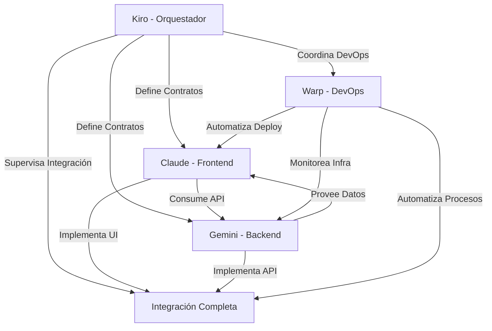

# KIRO.md

Este documento define el plan de orquestación para el proyecto CMS de Grupo Naser, estableciendo la coordinación entre Claude (Frontend) y Gemini (Backend).

## Visión General del Proyecto

Grupo Naser CMS es un sistema de gestión de contenidos basado en React para el sitio web de servicios funerarios, diseñado específicamente para despliegue en **GoDaddy shared hosting**. El proyecto reemplaza el sitio HTML estático actual con una solución dinámica que incluye un frontend React para visitantes y un panel de administración React+PHP.

**🚨 ACTUALIZACIÓN CRÍTICA (18 Jul 2025)**: Se ha identificado un gap significativo entre el diseño del sitio actual y el frontend React desarrollado. Se requiere un rediseño completo para alineación con la identidad visual real.

## Estructura de Orquestación

### Roles y Responsabilidades

#### Kiro (Orquestador)

- **Rol Principal**: Orquestador y Coordinador del Proyecto
- **Responsabilidades**:
  - Planificación estratégica y priorización
  - Coordinación entre equipos frontend y backend
  - Gestión de integración y puntos de contacto
  - Control de calidad y estándares
  - Resolución de conflictos técnicos
  - Mantenimiento de documentación central

#### Claude (Frontend)

- **Rol Principal**: Desarrollador Frontend y Diseñador Visual
- **Responsabilidades**:
  - Rediseño visual basado en el sitio actual
  - Desarrollo de componentes React
  - Implementación de interfaces de usuario
  - Integración con API backend
  - Testing de componentes frontend
  - Optimización de rendimiento visual

#### Gemini (Backend)

- **Rol Principal**: Desarrollador Backend y Arquitecto de Datos
- **Responsabilidades**:
  - Implementación de Clean Architecture
  - Desarrollo de API RESTful
  - Modelado y gestión de datos
  - Seguridad y autenticación
  - Testing de API y modelos
  - Optimización de consultas y rendimiento

#### Warp (DevOps)

- **Rol Principal**: Especialista en DevOps y Automatización
- **Responsabilidades**:
  - Automatización de infraestructura y deployment
  - Gestión de contenedores Docker y orquestación
  - Monitoreo continuo de performance y salud del sistema
  - Optimización de pipelines CI/CD
  - Gestión de backups y recuperación de datos
  - Preparación y optimización para deployment en GoDaddy
  - Automatización de testing y quality assurance

### Flujo de Comunicación



## Plan de Acción Inmediato (Próximos 7 días)

### Día 1-2: Análisis y Planificación

1. **Reunión de Kickoff**

   - Presentar plan de orquestación a Claude y Gemini
   - Establecer expectativas y plazos
   - Definir puntos de integración críticos

2. **Análisis de Gap Visual**

   - Claude: Analizar detalladamente index.html actual
   - Extraer paleta de colores, tipografías, y elementos visuales clave
   - Crear documento de especificaciones visuales (VISUAL_SPEC.md)

3. **Definición de Contratos API**
   - Gemini: Revisar contratos API existentes
   - Priorizar endpoints críticos para frontend
   - Establecer formato de respuesta estándar (API_SPEC.md)

### Día 3-5: Implementación Paralela

4. **Frontend (Claude)**

   - Implementar rediseño visual (R1-R5 en roadmap)
   - Priorizar componentes visuales clave:
     - Hero con imagen de fondo + overlays
     - Cards doradas y elementos premium
     - Layout cinematográfico
   - Crear componentes React que reflejen fielmente el diseño actual

5. **Backend (Gemini)**

   - Implementar estructura Clean Architecture (Tarea 1.5)
   - Crear esquema de base de datos (Tarea 2.1)
   - Desarrollar endpoint de autenticación (prioridad alta)

6. **Integración (Kiro)**
   - Configurar Git hooks con Husky (Tarea 1.4)
   - Establecer pipeline de pruebas automatizadas
   - Crear scripts de integración para validar frontend-backend

### Día 6-7: Validación y Ajustes

7. **Revisión de Progreso**

   - Validación visual del rediseño frontend
   - Pruebas de integración con endpoints API
   - Ajustes basados en feedback

8. **Planificación del Siguiente Sprint**
   - Definir próximas tareas prioritarias
   - Actualizar roadmap.md con progreso
   - Establecer objetivos para la siguiente fase

## Herramientas y Procesos

### Entorno Docker

- Utilizar scripts existentes para desarrollo consistente:
  ```bash
  ./scripts/dev.sh    # Iniciar entorno completo
  ./scripts/test.sh   # Ejecutar tests
  ```

### Flujo de Trabajo Diario

1. **Stand-up Virtual** (inicio del día)

   - Revisar progreso del día anterior
   - Identificar bloqueadores
   - Establecer objetivos del día

2. **Desarrollo Paralelo**

   - Claude: Componentes visuales React
   - Gemini: Endpoints API y modelos de datos
   - Kiro: Integración y coordinación

3. **Integración Continua**

   - Ejecutar tests automatizados
   - Validar contratos API
   - Verificar alineación visual

4. **Revisión de Fin de Día**
   - Documentar progreso
   - Actualizar archivos de comunicación
   - Planificar siguiente día

## Puntos de Integración Críticos

### 1. Autenticación

- **Frontend**: Formulario de login y gestión de tokens JWT
- **Backend**: Endpoint de autenticación y validación de tokens
- **Contrato**: Formato de solicitud/respuesta para login y refresh

### 2. Gestión de Contenido

- **Frontend**: Interfaces para crear/editar páginas y servicios
- **Backend**: Endpoints CRUD para contenido
- **Contrato**: Formato de datos para páginas, servicios y ubicaciones

### 3. Gestión de Medios

- **Frontend**: Componente de carga y visualización de imágenes
- **Backend**: Endpoint para subida y optimización de imágenes
- **Contrato**: Formato de respuesta para archivos subidos

### 4. Formularios de Contacto

- **Frontend**: Componentes de formulario con validación
- **Backend**: Endpoint para procesamiento de formularios
- **Contrato**: Formato de datos para envío de formularios

## Métricas de Éxito

### Corto Plazo (7 días)

- Rediseño visual implementado (R1-R5)
- Estructura Clean Architecture establecida
- Esquema de base de datos implementado
- Al menos un endpoint API funcional (autenticación)

### Mediano Plazo (14 días)

- Frontend completamente rediseñado
- API core implementada (autenticación, páginas, servicios)
- Integración frontend-backend funcional
- Tests automatizados con cobertura >80%

### Largo Plazo (30 días)

- CMS completamente funcional
- Migración de datos del sitio actual
- Preparación para despliegue en GoDaddy
- Documentación completa

## Documentación Relacionada

- **VISUAL_SPEC.md**: Especificaciones visuales (mantenido por Claude)
- **API_SPEC.md**: Especificaciones de API (mantenido por Gemini)
- **DAILY_SYNC.md**: Registro de sincronización diaria (mantenido por Kiro)
- **roadmap.md**: Plan general del proyecto (mantenido por Kiro)

## Gestión de Riesgos

### Riesgos Identificados

1. **Gap Visual**: Diferencia significativa entre diseño actual y frontend React
2. **Integración Frontend-Backend**: Posibles incompatibilidades en contratos API
3. **Compatibilidad GoDaddy**: Limitaciones del hosting compartido
4. **Migración de Datos**: Complejidad en transferir contenido existente

### Estrategias de Mitigación

1. **Análisis Visual Detallado**: Documentar exhaustivamente elementos visuales del sitio actual
2. **Contratos API Claros**: Definir y documentar formatos de solicitud/respuesta
3. **Pruebas de Compatibilidad**: Simular entorno GoDaddy en Docker
4. **Plan de Migración Gradual**: Priorizar contenido crítico primero

---

**Última actualización**: 18 de julio de 2025  
**Estado del proyecto**: Fase de rediseño y orquestación  
**Próxima revisión**: 25 de julio de 2025
