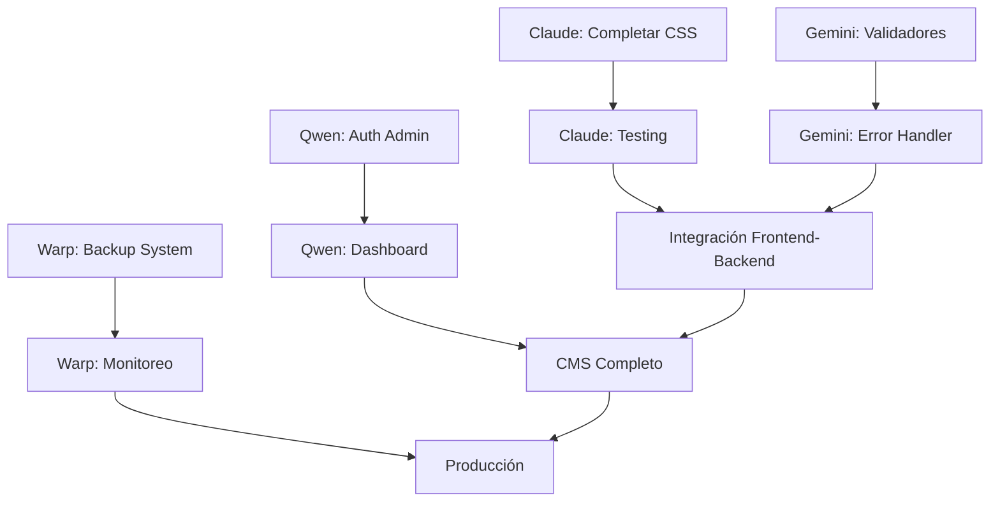

# 🎯 ORQUESTACIÓN DE TAREAS - 4 AGENTES GRUPO NASER CMS

## 📊 ESTADO ACTUAL DEL PROYECTO

- **Progreso Global**: ~45% (13.5/30 tareas completadas)
- **Fase Actual**: Desarrollo paralelo + Dashboard de administración
- **Agentes Activos**: 4 (Claude, Gemini, Warp, Qwen)
- **Orquestador**: Kiro

## 🎨 CLAUDE - Frontend React Specialist

### 🚨 PRIORIDAD CRÍTICA: Resolución de Problemas + Pixel Perfect

**Archivo**: `PROMPT-CLAUDE-BATCH-5.md`

#### FASE 1: Resolución Crítica (INMEDIATA)

- **C1**: ✅ Configuración TypeScript completa (COMPLETADO)
- **C2**: 🔄 Corrección errores CSS críticos (EN PROGRESO)
- **C3**: ✅ Sistema de Design Tokens avanzado (COMPLETADO)
- **C4**: ⏳ Validación y testing de configuración

#### FASE 2: Implementación Pixel Perfect

- **P1**: 🔄 Header completo con sub-header (EN PROGRESO)
- **P2**: ⏳ Hero slider cinematográfico
- **P3**: ⏳ Conversión de 13 páginas HTML a React

**Estimación**: 4-6 horas  
**Impacto**: CRÍTICO - Desbloquea todo el desarrollo frontend  
**Progreso**: 28.5% completado

---

## 🔧 GEMINI - Backend PHP Specialist

### 🎯 EXPANSIÓN DE API CORE + INTEGRACIÓN

**Archivo**: `PROMPT-GEMINI-BATCH-3.md`

#### FASE 1: API Endpoints Completos

- **G1**: ✅ AuthController con JWT completo (COMPLETADO)
- **G2**: ❌ ContentController para gestión CMS (PENDIENTE)
- **G3**: ✅ ServiceController para servicios funerarios (COMPLETADO)
- **G4**: ✅ LocationController para sucursales (COMPLETADO)

#### FASE 2: Integración y Seguridad

- **G5**: ✅ Middleware de autenticación JWT (COMPLETADO)
- **G6**: ❌ Sistema de validación robusto (PENDIENTE)
- **G7**: ❌ Manejo de errores centralizado (PENDIENTE)
- **G8**: 🔄 Testing completo de APIs (EN PROGRESO)

**Estimación**: 5-7 horas  
**Impacto**: ALTO - Completa el backend para integración  
**Progreso**: 62.5% completado

---

## ⚡ WARP - DevOps & Infrastructure Specialist

### 🏗️ INFRAESTRUCTURA AVANZADA + DEPLOYMENT

**Archivo**: `PROMPT-WARP-BATCH-5.md`

#### FASE 1: Infraestructura Avanzada

- **W1**: ✅ Pipeline CI/CD con GitHub Actions (COMPLETADO)
- **W2**: ✅ Optimización Docker para producción (COMPLETADO)
- **W3**: ⏳ Sistema de monitoreo avanzado (Prometheus/Grafana)
- **W4**: ⏳ Backup y recovery automatizado (PRIORIDAD)

#### FASE 2: Deployment y Optimización

- **W5**: ⏳ Deployment automatizado a GoDaddy
- **W6**: ⏳ Performance monitoring en tiempo real
- **W7**: ⏳ Security hardening completo

**Estimación**: 6-8 horas  
**Impacto**: ALTO - Infraestructura escalable y segura  
**Progreso**: 28.5% completado

---

## 🎛️ QWEN - Admin Dashboard Specialist

### 🖥️ DASHBOARD DE ADMINISTRACIÓN CMS

**Archivo**: `PROMPT-QWEN-BATCH-1-ADMIN-DASHBOARD.md` (Actualizado - Instrucciones refinadas)

#### FASE 1: Dashboard Core

- **Q1**: ⏳ Sistema de autenticación admin
- **Q2**: ⏳ Dashboard principal con métricas
- **Q3**: ⏳ Gestión de páginas y contenido
- **Q4**: ⏳ Gestión de servicios funerarios

#### FASE 2: Funcionalidades Avanzadas

- **Q5**: ⏳ Gestión de ubicaciones/sucursales
- **Q6**: ⏳ Sistema de medios y archivos
- **Q7**: ⏳ Gestión de usuarios y permisos
- **Q8**: ⏳ Configuraciones del sistema

**Estimación**: 8-10 horas  
**Impacto**: ALTO - Sistema de administración completo  
**Progreso**: 0% (NUEVO)

---

## 🔄 FLUJO DE TRABAJO COORDINADO

### Secuencia de Ejecución

1. **CLAUDE** (Inmediato): Completar C2 (CSS) → C4 (Testing) → P2 (Hero Slider)
2. **GEMINI** (Paralelo): G6 (Validadores) → G7 (Error Handler) → G8 (Tests)
3. **WARP** (Paralelo): W4 (Backup) → W3 (Monitoreo) → W5 (GoDaddy)
4. **QWEN** (Nuevo): Q1 (Auth Admin) → Q2 (Dashboard) → Q3 (Páginas)

### Dependencias Críticas



## 📈 MÉTRICAS DE ÉXITO

### Claude (Frontend)

- ✅ Build sin errores (dev + prod)
- ✅ Tests pasando al 100%
- ✅ Al menos 5 páginas convertidas a React
- ✅ Performance Lighthouse > 90

### Gemini (Backend)

- ✅ Todos los endpoints funcionando
- ✅ Sistema de validación robusto
- ✅ Tests unitarios > 90% cobertura
- ✅ Error handling centralizado

### Warp (DevOps)

- ✅ Sistema de backup automatizado
- ✅ Monitoreo en tiempo real activo
- ✅ Deployment a GoDaddy exitoso
- ✅ Security hardening implementado

### Qwen (Admin Dashboard)

- ✅ Sistema de autenticación funcional
- ✅ CRUD completo para todas las entidades
- ✅ Dashboard con métricas en tiempo real
- ✅ Interfaz intuitiva y responsive

## 🎯 OBJETIVOS DE LA SESIÓN

### Progreso Esperado

- **Actual**: ~45% (13.5/30 tareas)
- **Meta**: 65%+ (19+ tareas completadas)
- **Incremento**: +20% en una sesión coordinada

### Funcionalidades Clave

1. **Frontend funcional** con páginas principales (Claude)
2. **API completa** con validación y error handling (Gemini)
3. **Infraestructura robusta** con backup y monitoreo (Warp)
4. **Dashboard admin** con gestión de contenido (Qwen)

## 🚀 COMANDOS DE COORDINACIÓN

### Para Claude

```bash
cd src/frontend
npm run dev    # Desarrollo
npm run build  # Producción
npm test       # Testing
```

### Para Gemini

```bash
cd api
composer install
composer test
composer cs
```

### Para Warp

```bash
docker-compose up -d
./scripts/backup-system.sh
./scripts/deploy-godaddy.sh staging
```

### Para Qwen

```bash
cd src/admin
npm run dev    # Desarrollo admin
npm run build  # Build admin
npm test       # Tests admin
```

## 📋 CHECKLIST DE COORDINACIÓN

### Pre-ejecución

- [ ] Todos los agentes tienen acceso a sus prompts específicos
- [ ] APIs de Gemini funcionando para Qwen
- [ ] Entorno de desarrollo funcional
- [ ] Backups realizados

### Durante ejecución

- [ ] Monitorear progreso de cada agente
- [ ] Coordinar integración admin con APIs
- [ ] Resolver conflictos de merge si aparecen
- [ ] Validar que no hay regresiones

### Post-ejecución

- [ ] Validar integración completa
- [ ] Ejecutar tests end-to-end
- [ ] Probar dashboard admin completo
- [ ] Actualizar documentación

## 🎊 RESULTADO ESPERADO

Al final de esta sesión coordinada:

1. **Frontend desbloqueado** - Páginas React funcionando (Claude)
2. **Backend robusto** - APIs con validación completa (Gemini)
3. **Infraestructura lista** - Backup y monitoreo activos (Warp)
4. **CMS completo** - Dashboard admin funcional (Qwen)

**¡Esta sesión completará las funcionalidades core del CMS Grupo Naser!**

---

**Orquestado por**: Kiro  
**Fecha**: 31 de julio de 2025  
**Prioridad**: 🔴 CRÍTICA  
**Duración estimada**: 8-10 horas coordinadas  
**Agentes**: 4 (Claude, Gemini, Warp, Qwen)
