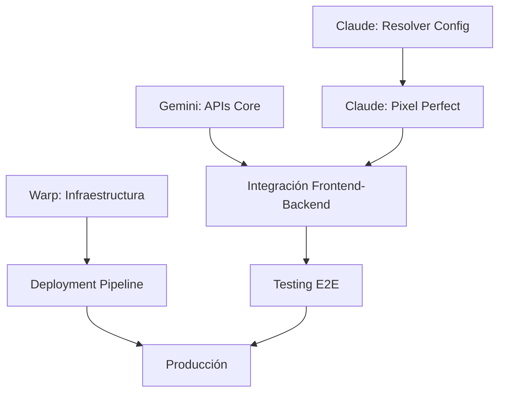

# 🎯 ORQUESTACIÓN DE TAREAS - GRUPO NASER CMS

## 📊 ESTADO ACTUAL DEL PROYECTO

- **Progreso Global**: 36.67% (11/30 tareas completadas)
- **Fase Actual**: Resolución crítica + Expansión de funcionalidades
- **Agentes Activos**: 3 (Claude, Gemini, Warp)
- **Orquestador**: Kiro

## 🎨 CLAUDE - Frontend React Specialist

### 🚨 PRIORIDAD CRÍTICA: Resolución de Problemas Bloqueantes

**Archivo**: `PROMPT-CLAUDE-BATCH-5.md`

#### FASE 1: Resolución Crítica (INMEDIATA)

- **C1**: Configuración TypeScript completa (`tsconfig.json`, conversión JSX→TSX)
- **C2**: Corrección errores CSS críticos (rutas, importaciones)
- **C3**: Sistema de Design Tokens avanzado
- **C4**: Validación y testing de configuración

#### FASE 2: Implementación Pixel Perfect

- **P1**: Header completo con sub-header
- **P2**: Hero slider cinematográfico
- **P3**: Conversión de 13 páginas HTML a React

**Estimación**: 4-6 horas  
**Impacto**: CRÍTICO - Desbloquea todo el desarrollo frontend

---

## 🔧 GEMINI - Backend PHP Specialist

### 🎯 EXPANSIÓN DE API CORE + INTEGRACIÓN

**Archivo**: `PROMPT-GEMINI-BATCH-3.md`

#### FASE 1: API Endpoints Completos

- **G1**: AuthController con JWT completo
- **G2**: ContentController para gestión CMS
- **G3**: ServiceController para servicios funerarios
- **G4**: LocationController para sucursales

#### FASE 2: Integración y Seguridad

- **G5**: Middleware de autenticación JWT
- **G6**: Sistema de validación robusto
- **G7**: Manejo de errores centralizado
- **G8**: Testing completo de APIs

**Estimación**: 5-7 horas  
**Impacto**: ALTO - Completa el backend para integración frontend

---

## ⚡ WARP - DevOps & Infrastructure Specialist

### 🏗️ INFRAESTRUCTURA AVANZADA + DEPLOYMENT

**Archivo**: `PROMPT-WARP-BATCH-5.md`

#### FASE 1: Infraestructura Avanzada

- **W1**: Pipeline CI/CD con GitHub Actions
- **W2**: Optimización Docker para producción
- **W3**: Sistema de monitoreo avanzado (Prometheus/Grafana)
- **W4**: Backup y recovery automatizado

#### FASE 2: Deployment y Optimización

- **W5**: Deployment automatizado a GoDaddy
- **W6**: Performance monitoring en tiempo real
- **W7**: Security hardening completo

**Estimación**: 6-8 horas  
**Impacto**: ALTO - Infraestructura robusta para producción

---

## 🔄 FLUJO DE TRABAJO COORDINADO

### Secuencia de Ejecución

1. **CLAUDE** (Inmediato): Resolver problemas críticos de configuración
2. **GEMINI** (Paralelo): Desarrollar APIs mientras Claude resuelve frontend
3. **WARP** (Paralelo): Configurar infraestructura avanzada
4. **INTEGRACIÓN**: Una vez completadas las fases individuales

### Dependencias Críticas



## 📈 MÉTRICAS DE ÉXITO

### Claude (Frontend)

- ✅ Build sin errores (dev + prod)
- ✅ Tests pasando al 100%
- ✅ TypeScript configurado correctamente
- ✅ Al menos 5 páginas convertidas a React
- ✅ Performance Lighthouse > 90

### Gemini (Backend)

- ✅ Todos los endpoints funcionando
- ✅ Autenticación JWT operativa
- ✅ Tests unitarios > 90% cobertura
- ✅ APIs documentadas completamente
- ✅ Validación y seguridad implementadas

### Warp (DevOps)

- ✅ Pipeline CI/CD funcionando
- ✅ Monitoreo en tiempo real activo
- ✅ Backup automatizado configurado
- ✅ Deployment a GoDaddy exitoso
- ✅ Security hardening implementado

## 🎯 OBJETIVOS DE LA SESIÓN

### Progreso Esperado

- **Actual**: 36.67% (11/30 tareas)
- **Meta**: 60%+ (18+ tareas completadas)
- **Incremento**: +23% en una sesión

### Funcionalidades Clave

1. **Frontend funcional** con páginas principales
2. **API completa** para todas las operaciones
3. **Infraestructura robusta** para producción
4. **Pipeline de deployment** automatizado

## 🚀 COMANDOS DE COORDINACIÓN

### Para Claude

```bash
cd src/frontend
npm run dev    # Desarrollo
npm run build  # Producción
npm test       # Testing
```

### Para Gemini

```bash
cd api
composer install
composer test
composer cs
```

### Para Warp

```bash
docker-compose up -d
./scripts/backup-system.sh
./scripts/deploy-godaddy.sh staging
```

## 📋 CHECKLIST DE COORDINACIÓN

### Pre-ejecución

- [ ] Todos los agentes tienen acceso a sus prompts específicos
- [ ] Dependencias del proyecto actualizadas
- [ ] Entorno de desarrollo funcional
- [ ] Backups realizados

### Durante ejecución

- [ ] Monitorear progreso de cada agente
- [ ] Resolver conflictos de merge si aparecen
- [ ] Coordinar integraciones entre componentes
- [ ] Validar que no hay regresiones

### Post-ejecución

- [ ] Validar integración completa
- [ ] Ejecutar tests end-to-end
- [ ] Actualizar documentación
- [ ] Preparar siguiente iteración

## 🎊 RESULTADO ESPERADO

Al final de esta sesión coordinada:

1. **Frontend desbloqueado** - Configuración TypeScript + páginas React
2. **Backend completo** - APIs robustas con autenticación
3. **Infraestructura lista** - Pipeline CI/CD + monitoreo
4. **Proyecto escalable** - Base sólida para siguientes fases

**¡Esta sesión será un hito importante en el desarrollo del proyecto Grupo Naser CMS!**

---

**Orquestado por**: Kiro  
**Fecha**: 2025-07-31  
**Prioridad**: 🔴 CRÍTICA  
**Duración estimada**: 6-8 horas coordinadas
