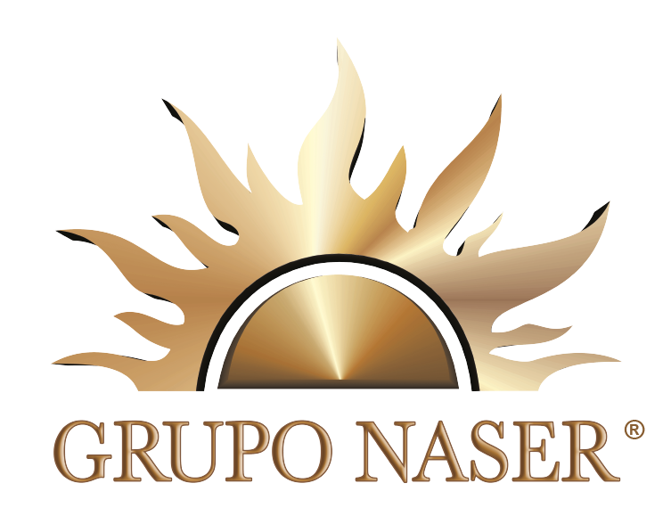

# ⚰️ Grupo Naser - React CMS para Servicios Funerarios

[](https://opensource.org/licenses/MIT "MIT License")

[](https://github.com/axlwolf/webnaser)
[](https://reactjs.org/)
[](https://godaddy.com/)
[](https://github.com/axlwolf/webnaser)
[](https://docker.com/)



Sistema de Gestión de Contenidos (CMS) basado en React para servicios funerarios de Grupo Naser, diseñado específicamente para despliegue en **GoDaddy shared hosting**. Incluye frontend React para visitantes y panel de administración React+PHP para gestión de contenido.

**🐳 Entorno Docker Completo**: Desarrollo y producción completamente dockerizados para máxima consistencia y colaboración entre equipos.

**⚠️ IMPORTANTE**: Se identificó un gap significativo entre el diseño actual del sitio web y la implementación React. El frontend requiere rediseño completo para coincidir con la identidad visual real de Grupo Naser.

## Características Planificadas

- **Frontend React**: Interfaz pública moderna y responsive para visitantes
- **Panel de Administración**: React+PHP para gestión de contenido por administradores
- **API REST**: Backend PHP optimizado para GoDaddy shared hosting
- **Base de Datos**: MySQL/MariaDB con arquitectura limpia
- **Autenticación**: Sistema seguro con JWT tokens
- **Gestión de Contenido**: Páginas dinámicas, servicios, ubicaciones y medios
- **SEO Optimizado**: Meta tags dinámicos, sitemap y estructura semántica
- **Responsive Design**: Mobile-first approach con CSS modules
- **Testing**: Cobertura completa con Vitest (React) y PHPUnit (PHP)
- **Docker**: Entorno completo con Docker Compose para desarrollo y producción
- **Base de Datos**: MySQL 8.0 con migraciones y phpMyAdmin incluido

## Estado del Proyecto

**Progreso General: 30%** (Reevaluado: 18 de julio de 2025)  
**Fase Actual**: Análisis completado, rediseño frontend requerido  
**Orquestador**: Keiro (próximo a unirse)

### ✅ Completado - Fase Inicial
- **Configuración Base**: React frontend con Vite, PHP backend, estructura de directorios
- **Infraestructura de Testing**: Vitest (React) y PHPUnit (PHP) configurados
- **Herramientas de Desarrollo**: ESLint, PHP CodeSniffer, PHP Mess Detector
- **🐳 Docker Completo**: Entorno de desarrollo y producción dockerizado
- **🎨 Frontend Prototipo**: Header, Navigation, Logo y páginas básicas (requiere rediseño)
- **🌐 Internacionalización**: Sistema completo en español mexicano
- **📊 Base de Datos**: Esquema MySQL con migraciones iniciales
- **🔧 Scripts de Automatización**: dev.sh, test.sh, deploy.sh
- **📚 Documentación**: Docker, desarrollo y arquitectura completa
- **🔍 Análisis de Diseño**: Identificación de gaps con sitio actual

### 🔄 En Progreso - Fase de Rediseño
- **🎨 Rediseño Frontend**: Alineación con identidad visual real de Grupo Naser
- **API REST**: Endpoints y autenticación (pendiente para Gemini)
- **Panel de Administración**: Gestión de contenido

### ❌ Pendiente - Próximas Fases
- **🎨 Frontend Redesign**: Implementar diseño real basado en análisis del sitio actual
- **Backend PHP**: Implementación de API REST por Gemini (coordinado por Keiro)
- **Integración API-Frontend**: Conexión completa
- **Componentes React Avanzados**: Formularios, galerías, mapas con diseño real
- **Migración de Datos**: Del sitio HTML actual al CMS
- **Deploy en GoDaddy**: Configuración final de hosting

### 🚨 Gap Crítico Identificado
**Diseño Actual vs React Frontend**: El sitio web actual tiene una identidad visual específica (colores marrones/dorados, logo con símbolo solar, layout cinematográfico) que difiere significativamente del frontend React desarrollado. Se requiere rediseño completo antes de continuar.

## Arquitectura y Estructura

### Arquitectura de Tres Capas

- **Frontend Estático**: Páginas HTML/CSS/JS de marketing (nivel raíz)
- **Frontend React**: Aplicación pública en `src/frontend/`
- **Panel de Administración**: Aplicación React en `src/admin/`
- **Backend API**: API PHP en `api/`

### Estructura de Directorios

```
web_naser_23/
├── 🐳 docker-compose.yml         # Desarrollo con Docker
├── 🐳 docker-compose.prod.yml    # Producción con Docker
├── 🐳 DOCKER.md                  # Documentación completa Docker
├── api/                          # PHP backend API
│   ├── 🐳 Dockerfile
│   ├── docker/                   # Configuraciones Docker
│   ├── src/                      # Código fuente PHP
│   └── composer.json             # Dependencias PHP
├── src/
│   ├── admin/                    # Panel de administración React
│   ├── frontend/                 # Frontend público React
│   │   ├── 🐳 Dockerfile
│   │   └── nginx.conf            # Configuración Nginx
│   ├── components/               # Componentes React compartidos
│   ├── constants/                # Textos en español y configuración
│   ├── styles/                   # Tokens de diseño y CSS global
│   └── utils/                    # Formatters y validadores mexicanos
├── 🐳 scripts/                   # Scripts de automatización
│   ├── dev.sh                    # Iniciar desarrollo
│   ├── test.sh                   # Ejecutar tests
│   └── deploy.sh                 # Desplegar producción
├── database/                     # Migraciones y seeds MySQL
├── docker/                       # Configuraciones Docker globales
├── tests/                        # Testing (PHPUnit + Vitest)
├── memory-bank/                  # Documentación del proyecto
├── .kiro/                        # Especificaciones técnicas
└── [páginas].html               # Páginas de marketing estáticas
```

### Componentes Clave

- **🐳 Docker**: Entorno completo de desarrollo y producción
- **Clean Architecture**: Separación clara entre dominio, aplicación e infraestructura
- **Compatibilidad GoDaddy**: Optimizado para hosting compartido
- **Testing**: Cobertura obligatoria del 80% (Vitest + PHPUnit)
- **Responsive Design**: Mobile-first con CSS modules
- **🌐 Español Mexicano**: Localización completa (es-MX) con formatters

## Tecnologías Utilizadas

### Frontend
- **Framework**: React 19.1.0 con Vite
- **Routing**: React Router DOM v7.7.0
- **Estilos**: CSS Modules con metodología BEM
- **Testing**: Vitest con Testing Library
- **Build**: Vite con configuración optimizada para GoDaddy

### Backend
- **Lenguaje**: PHP 7.4+ (compatible con GoDaddy)
- **Arquitectura**: MVC con Repository pattern
- **Base de Datos**: MySQL/MariaDB con PDO
- **Autenticación**: JWT tokens
- **Testing**: PHPUnit 9.5

### Herramientas de Desarrollo
- **🐳 Docker**: Docker Compose para desarrollo y producción
- **Calidad de Código**: ESLint, PHP CodeSniffer, PHP Mess Detector
- **Testing**: Vitest (frontend), PHPUnit (backend)
- **Automatización**: Scripts bash para dev, test y deploy
- **Base de Datos**: MySQL 8.0 + phpMyAdmin
- **Hosting**: GoDaddy shared hosting

## Uso y Desarrollo

### Prerrequisitos

- **Docker Desktop** 4.0+ (requerido)
- **Docker Compose** 2.0+
- **Git** (para clonado del repositorio)
- **4GB+ RAM** disponible para contenedores

### 🚀 Inicio Rápido con Docker

```bash
# 1. Clonar el repositorio
git clone <repository-url>
cd web_naser_23

# 2. Configuración inicial
cp .env.example .env

# 3. Iniciar entorno completo
./scripts/dev.sh
```

**¡Listo!** Después de ejecutar el script tendrás:
- **Frontend React**: http://localhost:3000
- **Backend PHP API**: http://localhost:8000  
- **Sitio Completo**: http://localhost
- **phpMyAdmin**: http://localhost:8080

### 🔧 Comandos de Desarrollo

```bash
# Desarrollo
./scripts/dev.sh        # Iniciar entorno completo
./scripts/test.sh       # Ejecutar todos los tests
./scripts/deploy.sh     # Desplegar a producción

# Docker manual
docker-compose up -d    # Iniciar servicios
docker-compose logs -f  # Ver logs en tiempo real
docker-compose down     # Parar servicios

# Comandos en contenedores
docker exec naser_frontend npm run test
docker exec naser_backend composer test
docker exec naser_backend php migrate.php
```

### 📊 Base de Datos

**Credenciales de desarrollo:**
- **Host**: localhost:3306
- **Usuario**: naser_user  
- **Contraseña**: naser_pass_2024
- **Base de datos**: naser_cms

Ver **`DOCKER.md`** para documentación completa.

### 👥 Colaboración con Gemini

Este proyecto está diseñado para colaboración entre **Claude (Frontend)** y **Gemini (Backend)**:

- **Claude**: Responsable del frontend React y componentes
- **Gemini**: Responsable del backend PHP y API REST
- **Compartido**: Base de datos MySQL y documentación

**Flujo de trabajo:**
1. Ambos usan el mismo entorno Docker
2. Claude desarrolla en `/src/frontend` y `/src/components`
3. Gemini desarrolla en `/api` y `/database`
4. Sincronización through Docker y base de datos compartida

## Documentación

### Documentación del Proyecto
- **🐳 `DOCKER.md`**: Guía completa de Docker (desarrollo y producción)
- **`CLAUDE.md`**: Guía para desarrollo con Claude Code
- **`GEMINI.md`**: Guía para colaboración con Gemini
- **`roadmap.md`**: Estado actual y próximos pasos del proyecto
- **`memory-bank/ripperFive.md`**: Protocolo Ripper Five para desarrollo con IA

### Especificaciones Técnicas
- **`.kiro/specs/react-cms-godaddy/`**: Especificaciones detalladas del CMS
- **`.kiro/steering/`**: Estándares de desarrollo y arquitectura

### Contexto del Proyecto
- **`memory-bank/memory-bank.md`**: Contexto y alcance del proyecto
- **`memory-bank/activeContext.md`**: Contexto activo de desarrollo

## Protocolo de Desarrollo

Este proyecto sigue el **Protocolo Ripper Five Optimizado** para desarrollo asistido por IA:

1. **RESEARCH**: Investigación y comprensión del código existente
2. **INNOVATE**: Exploración de soluciones y enfoques
3. **PLAN**: Creación de planes de implementación detallados
4. **CODE**: Escritura de código siguiendo los planes
5. **EXECUTE**: Testing y verificación de implementaciones

Ver `memory-bank/ripperFive.md` para detalles completos.

## Licencia

Este proyecto está licenciado bajo la Licencia MIT. Consulta el archivo LICENSE para más detalles.
