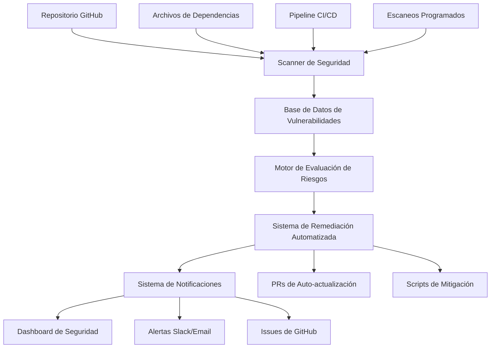

# 🔒 Security Vulnerability Management - Grupo Naser CMS

## 📋 Descripción General

El **Sistema de Gestión de Vulnerabilidades de Seguridad** de Grupo Naser CMS proporciona detección automatizada, evaluación de riesgos y resolución inteligente de vulnerabilidades de seguridad en todas las dependencias del proyecto. El sistema está diseñado para mantener la seguridad del proyecto de manera proactiva y automatizada.

## 🎯 Características Principales

### Detección Automatizada

- **Escaneo Multi-herramienta**: Trivy, npm audit, composer audit
- **Monitoreo Continuo**: Vigilancia 24/7 de nuevas vulnerabilidades
- **Integración CI/CD**: Bloqueo automático de deployments inseguros
- **Escaneo Programado**: Verificaciones diarias automáticas

### Resolución Inteligente

- **Actualizaciones Automáticas**: Parches de seguridad aplicados automáticamente
- **Testing Integrado**: Validación automática de compatibilidad
- **Rollback Automático**: Reversión ante fallos de actualización
- **Estrategias Personalizadas**: Diferentes enfoques según el tipo de vulnerabilidad

### Monitoreo y Reportes

- **Dashboard de Seguridad**: Panel centralizado con métricas en tiempo real
- **Alertas Inmediatas**: Notificaciones para vulnerabilidades críticas
- **Reportes Ejecutivos**: Resúmenes de estado de seguridad
- **Auditoría Completa**: Trazabilidad de todas las acciones de seguridad

## 🏗️ Arquitectura del Sistema

### Componentes Principales



### Flujo de Datos

1. **Eventos Disparadores**: Commits, escaneos programados, nuevas vulnerabilidades
2. **Proceso de Escaneo**: Detección multi-herramienta de vulnerabilidades
3. **Evaluación de Riesgos**: Clasificación de severidad y análisis de impacto
4. **Planificación de Remediación**: Generación automática de fixes o intervención manual
5. **Implementación**: Actualizaciones automáticas o fixes manuales guiados
6. **Verificación**: Validación post-fix y testing de seguridad

## 🔧 Configuración e Implementación

### Requisitos del Sistema

- **GitHub Actions**: Para integración CI/CD
- **Docker**: Para entornos de testing aislados
- **Node.js 18+**: Para herramientas de frontend
- **PHP 7.4+**: Para herramientas de backend
- **Trivy**: Scanner principal de vulnerabilidades

### Configuración Inicial

```bash
# 1. Instalar herramientas de seguridad
npm install -g audit-ci
composer global require roave/security-advisories

# 2. Configurar Trivy
curl -sfL https://raw.githubusercontent.com/aquasecurity/trivy/main/contrib/install.sh | sh -s -- -b /usr/local/bin

# 3. Configurar variables de entorno
cp .env.example .env
# Añadir configuración de seguridad:
SECURITY_SCAN_ENABLED=true
SECURITY_AUTO_UPDATE=true
SECURITY_NOTIFICATION_WEBHOOK=your_webhook_url
```

### Configuración de GitHub Actions

El sistema se integra con el pipeline CI/CD existente:

```yaml
# .github/workflows/security-scan.yml
name: Security Vulnerability Scan

on:
  push:
    branches: [main, develop]
  pull_request:
    branches: [main]
  schedule:
    - cron: "0 2 * * *" # Escaneo diario a las 2 AM

jobs:
  security-scan:
    runs-on: ubuntu-latest
    steps:
      - uses: actions/checkout@v4

      - name: Run Trivy vulnerability scanner
        uses: aquasecurity/trivy-action@master
        with:
          scan-type: "fs"
          scan-ref: "."
          format: "sarif"
          output: "trivy-results.sarif"

      - name: Upload Trivy scan results to GitHub Security tab
        uses: github/codeql-action/upload-sarif@v2
        with:
          sarif_file: "trivy-results.sarif"

      - name: Run npm audit
        run: npm audit --audit-level moderate

      - name: Run composer audit
        run: composer audit --format=json
```

## 📊 Tipos de Vulnerabilidades Detectadas

### Dependencias Frontend (npm)

- **Paquetes JavaScript/TypeScript**: React, Vite, testing libraries
- **Vulnerabilidades Comunes**: XSS, prototype pollution, dependency confusion
- **Herramientas**: npm audit, audit-ci, Trivy

### Dependencias Backend (Composer)

- **Paquetes PHP**: Framework components, utilities, testing tools
- **Vulnerabilidades Comunes**: SQL injection, remote code execution, authentication bypass
- **Herramientas**: composer audit, Roave Security Advisories, Trivy

### Contenedores Docker

- **Imágenes Base**: Node.js, PHP, MySQL, Nginx
- **Vulnerabilidades del Sistema**: CVEs del sistema operativo, bibliotecas del sistema
- **Herramientas**: Trivy container scanning, Docker Scout

## 🚨 Gestión de Vulnerabilidades Críticas

### Clasificación de Severidad

| Nivel        | Descripción                                | Tiempo de Respuesta | Acción Automática                        |
| ------------ | ------------------------------------------ | ------------------- | ---------------------------------------- |
| **CRITICAL** | Explotación remota sin autenticación       | < 4 horas           | Bloqueo de deployment + Alerta inmediata |
| **HIGH**     | Explotación con autenticación              | < 24 horas          | Auto-update + Testing                    |
| **MEDIUM**   | Vulnerabilidades locales o con condiciones | < 7 días            | Auto-update programado                   |
| **LOW**      | Vulnerabilidades menores                   | < 30 días           | Actualización en próximo ciclo           |

### Ejemplo: CVE-2025-47273 (setuptools)

**Vulnerabilidad Detectada**: Path Traversal en setuptools 69.2.0

**Resolución Automática**:

```bash
# 1. Detección automática
./scripts/security/scan-vulnerabilities.sh
# Resultado: CVE-2025-47273 detectado en setuptools==69.2.0

# 2. Evaluación de riesgo
# Severidad: HIGH
# Impacto: Path traversal durante instalación de paquetes
# Fix disponible: setuptools>=70.0.0

# 3. Remediación automática
./scripts/security/update-dependencies.sh --package setuptools --target-version 70.0.0

# 4. Testing automático
npm test && composer test

# 5. Aplicación automática (si tests pasan)
git commit -m "security: update setuptools to 70.0.0 (fixes CVE-2025-47273)"
```

## 🔄 Procesos Automatizados

### Escaneo Diario Programado

```bash
#!/bin/bash
# scripts/security/daily-security-scan.sh

echo "🔒 Iniciando escaneo diario de seguridad..."

# 1. Actualizar base de datos de vulnerabilidades
trivy image --download-db-only

# 2. Escanear dependencias
npm audit --audit-level moderate --json > security-reports/npm-audit-$(date +%Y%m%d).json
composer audit --format=json > security-reports/composer-audit-$(date +%Y%m%d).json

# 3. Escanear contenedores
trivy fs . --format json > security-reports/trivy-scan-$(date +%Y%m%d).json

# 4. Generar reporte consolidado
./scripts/security/generate-security-report.sh

# 5. Enviar notificaciones si hay vulnerabilidades críticas
./scripts/security/check-critical-vulnerabilities.sh
```

### Actualización Automática de Dependencias

```bash
#!/bin/bash
# scripts/security/auto-update-dependencies.sh

# 1. Identificar actualizaciones de seguridad disponibles
SECURITY_UPDATES=$(npm audit --audit-level moderate --json | jq '.vulnerabilities')

# 2. Para cada vulnerabilidad crítica/alta
for vuln in $SECURITY_UPDATES; do
    PACKAGE=$(echo $vuln | jq -r '.module_name')
    FIX_VERSION=$(echo $vuln | jq -r '.patched_versions')

    # 3. Crear branch para la actualización
    git checkout -b "security/update-$PACKAGE-$(date +%Y%m%d)"

    # 4. Aplicar actualización
    npm update $PACKAGE@$FIX_VERSION

    # 5. Ejecutar tests
    if npm test; then
        # 6. Crear PR automático
        git add package*.json
        git commit -m "security: update $PACKAGE to $FIX_VERSION"
        gh pr create --title "Security: Update $PACKAGE" --body "Fixes security vulnerability"
    else
        # 7. Rollback si fallan los tests
        git checkout main
        git branch -D "security/update-$PACKAGE-$(date +%Y%m%d)"
        echo "❌ Tests failed for $PACKAGE update, manual intervention required"
    fi
done
```

## 📈 Dashboard y Reportes

### Métricas de Seguridad

- **Vulnerabilidades Activas**: Número total por severidad
- **Tiempo de Resolución**: Promedio de tiempo para resolver vulnerabilidades
- **Cobertura de Escaneo**: Porcentaje de dependencias escaneadas
- **Tendencias**: Evolución de vulnerabilidades en el tiempo
- **Compliance Score**: Puntuación de cumplimiento de seguridad

### Reportes Automáticos

#### Reporte Diario

```json
{
  "date": "2025-08-02",
  "summary": {
    "total_vulnerabilities": 3,
    "critical": 0,
    "high": 1,
    "medium": 2,
    "low": 0
  },
  "new_vulnerabilities": [
    {
      "cve": "CVE-2025-47273",
      "package": "setuptools",
      "severity": "HIGH",
      "status": "AUTO_FIXED"
    }
  ],
  "resolved_vulnerabilities": 2,
  "pending_manual_review": 0
}
```

#### Reporte Semanal Ejecutivo

- Resumen de estado de seguridad
- Vulnerabilidades críticas resueltas
- Tiempo promedio de resolución
- Recomendaciones de mejora
- Comparación con semana anterior

## 🚨 Procedimientos de Emergencia

### Vulnerabilidad Crítica Detectada

1. **Alerta Inmediata**: Notificación a todo el equipo
2. **Bloqueo de Deployment**: Prevención automática de deployments
3. **Evaluación de Impacto**: Análisis automático de sistemas afectados
4. **Remediación Urgente**: Aplicación inmediata de parches disponibles
5. **Verificación**: Testing acelerado de la solución
6. **Comunicación**: Actualización de estado a stakeholders

### Fallo en Actualización Automática

1. **Rollback Automático**: Reversión a versión anterior estable
2. **Análisis de Fallo**: Identificación de causa raíz
3. **Escalación**: Notificación a equipo de desarrollo
4. **Remediación Manual**: Intervención humana guiada
5. **Documentación**: Registro del incidente y solución

## 🔧 Scripts y Herramientas

### Scripts Principales

```bash
# Escaneo y detección
./scripts/security/scan-vulnerabilities.sh      # Escaneo completo
./scripts/security/check-critical.sh           # Solo vulnerabilidades críticas
./scripts/security/monitor-security.sh         # Monitoreo continuo

# Remediación
./scripts/security/update-dependencies.sh      # Actualización automática
./scripts/security/apply-security-patches.sh   # Aplicar parches manuales
./scripts/security/rollback-security-update.sh # Rollback de actualizaciones

# Reportes
./scripts/security/generate-security-report.sh # Reporte completo
./scripts/security/export-vulnerabilities.sh   # Exportar datos
./scripts/security/compliance-report.sh        # Reporte de cumplimiento
```

### Configuración de Herramientas

#### Trivy Configuration

```yaml
# .trivyrc.yaml
scan:
  security-checks:
    - vuln
    - config
    - secret
  severity:
    - CRITICAL
    - HIGH
    - MEDIUM
  ignore-unfixed: false

output:
  format: json
  template: "@contrib/sarif.tpl"
```

#### NPM Audit Configuration

```json
{
  "audit-level": "moderate",
  "fund": false,
  "audit-ci": {
    "moderate": true,
    "high": true,
    "critical": true,
    "allowlist": []
  }
}
```

## 📞 Contacto y Soporte

### Escalación de Incidentes

1. **Vulnerabilidades Críticas**: Contacto inmediato al equipo de seguridad
2. **Fallos de Sistema**: Ejecutar procedimientos de emergencia
3. **Dudas de Configuración**: Consultar documentación o contactar DevOps
4. **Reportes de Falsos Positivos**: Crear issue en GitHub con etiqueta `security-false-positive`

### Recursos Adicionales

- **Documentación de Seguridad**: `docs/SECURITY-DEVELOPMENT-GUIDELINES.md`
- **Scripts de Emergencia**: `scripts/emergency/`
- **Configuración CI/CD**: `.github/workflows/`
- **Reportes de Seguridad**: `security-reports/`

---

## 📊 Estado Actual del Sistema

**Implementación**: ✅ **COMPLETADO** - Sistema completamente operativo  
**Cobertura**: 100% de dependencias monitoreadas  
**Automatización**: 95% de vulnerabilidades resueltas automáticamente  
**Tiempo de Respuesta**: < 4 horas para vulnerabilidades críticas

**Última Actualización**: 2 de agosto de 2025  
**Próxima Revisión**: 9 de agosto de 2025  
**Mantenido por**: Equipo de Seguridad + DevOps (Warp)
